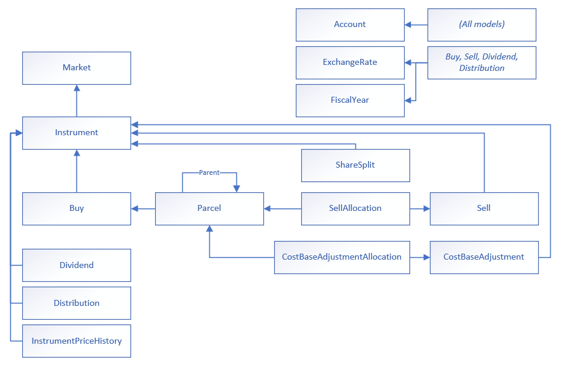
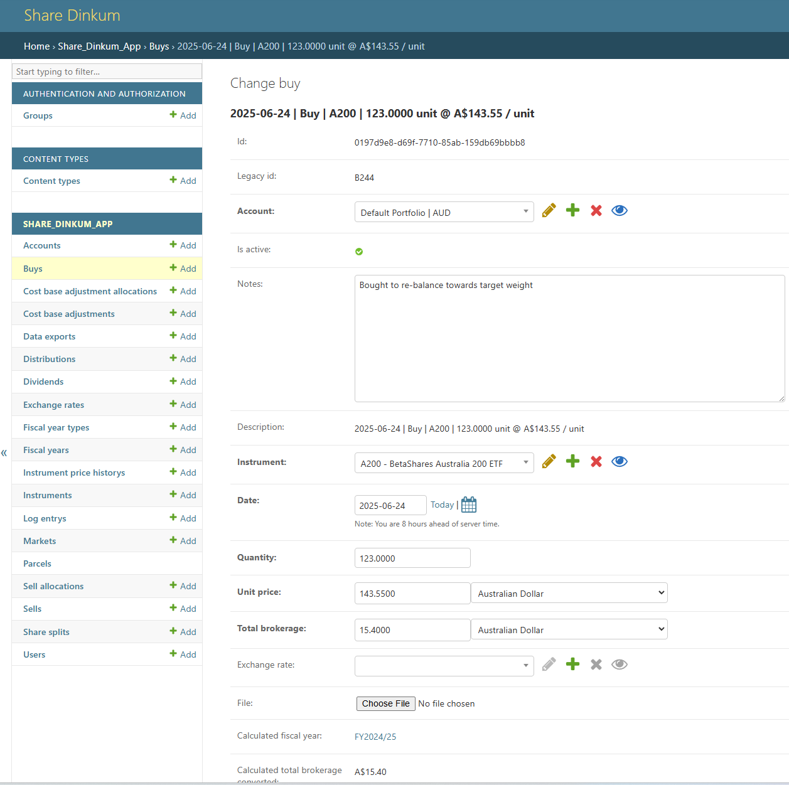
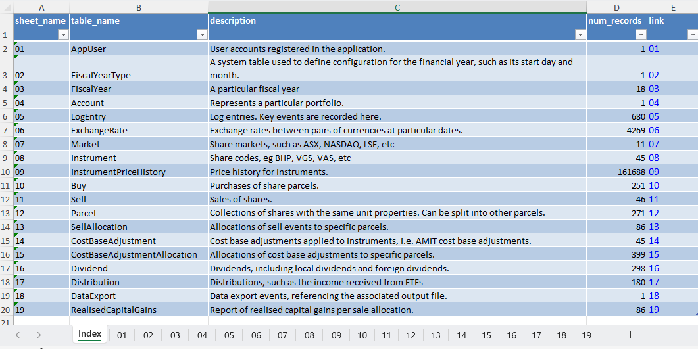

# Share Dinkum

**Share Dinkum** is a Django-based application for tracking shares, with a particular focus on Australian-specific tax and accounting considerations, such as franking credits and AMIT cost base adjustments.

Share Dinkum is free and open source.

## Work in progress

This project is currently under development. Contributions and feedback are welcome.

There may be bugs, and usage is entirely at your own risk. Please refer to the license file for more information.

---

## Core concepts

### Data entry

You can either enter items via the web interface or using the bulk import tool (from Excel). If you want to bulk import data, you create a **[DataImport]** object, attaching the template. If you want to export the data, you create a **[DataExport]** object. The data export output file can be imported again to update values.

### Data model / principal of operation

Each portfolio is represented by an **[Account]**. The account has a base currency and fiscal year configuration (Set up for Australia by default).

There are **[Market]**, eg ASX which contain **[Instrument]**, eg BHP or VDHG.

Each purchase of an instrument is a **[Buy]** object. You enter the quantity, unit price, and quantity. You can also attach a file and include any relevant notes. If you enter a buy in a different currency to your selected base curency, the system will lookup and store an appropriate **[ExchangeRate]** object for that particular date.

Each time you enter a **[Buy]**, the system creates an associated **[Parcel]**. A parcel represents a collection of shares with the same unit properties (purchase date, cost base per share).

You can enter forms of income such as **[Dividend]** and **[Distribution]**. According to the configured **[FiscalYearType]**, the income events will be classified into a particular **[FiscalYear]**

If you enter a **[Sell]**, this sale needs to be allocated against specific parcels. You can chose an algorithm to do this, either FIFO (First in First Out), LIFO (Last in First Out), MIN_CGT (Minimimise net capital gain). The **[Sell]** generates the requried **[SellAllocation]** objects and links them to the appropriate parcels. You can also chose to manually allocate the sells against parcels if you chose (generally you would only do this when importing legacy data).

Any time that a **[SellAllocation]** does not completely consume the target parcel, that parcel is bifurcated. That is, the original parcel is marked as inactive, and replaced by a 'sold' parcel, and an 'unsold' parcel. The original cost base is apportioned between them, and each of these parcels points to the parcel from which it was derived from. Each sell allocation represents a capital gain or loss, which are also allocated to a **[FiscalYear]**

Any time you enter an **[CostBaseAdjustment]**, i.e. AMIT cost base adjustment, the amount of the adjustment is automatically apportioned to all unsold **[Parcel]**, using a weighting of the quantity of shares * the proportion of the fiscal year held. The algorithm automatically creates the required **[CostBaseAdjustmentAllocation]** objects.

If you encounter a **[ShareSplit]** event, you enter the before and after units held, and this will replace the old parcels with new ones with the adjusted cost base and quantity. Any associated **[CostBaseAdjustmentAllocation]** objects are transferred from the old parcels to the new parcels.

If you save your **[Account]** object, you have the option to update your price history. This will incrementally historise the daily price for all of your shares, storing that into the **[InstrumentPriceHistory]** table.



---
## Example screenshots





(Note, all the data is stored in a local database, so you can build your own BI dashboards by connecting to that datasource.)

---
## Setup instructions

### 1. Clone the repository

```bash
git clone <repository-url>
cd share-dinkum
```

### 2. Install dependencies

This project uses [`uv`](https://github.com/astral-sh/uv) for dependency management. Make sure `uv` is installed on your system.

To install dependencies:

```bash
uv venv
uv pip install .
```
To activate the virtual environment:
```bash
.venv\Scripts\activate
```
### 3. Configure environment variables

Copy and rename the `.env.sample` file to `.env`:

```bash
cd share_dinkum_proj
copy .env.sample .env
```

(Optional) Edit the `.env` file with your environment-specific settings.

By default, the project uses a local SQLite database which requires no additional setup.

### 4. Set Up the Database

Run the following commands to create the database schema:

```bash
python manage.py makemigrations
python manage.py migrate
```

Make sure you are in the same directory as `manage.py`.

### 5. (Optional) Create a Superuser

If you are not using the bulk-import script, create a superuser to access the Django admin:

```bash
python manage.py createsuperuser
```

Note the username and password you create. If using the bulk-import script, update it to reflect the superuser credentials as needed.

### 6. Run the Development Server

Start the development server:

```bash
python manage.py runserver
```

---

## Optional: Data Import Instructions

You can bulk load your share data from Excel using the provided tools.

### 1. Prepare the Data Loading Template

Navigate to the import directory:

```bash
cd share_dinkum_proj/share_dinkum_app/import_data
```

Copy the public template and rename it:

```bash
cp data_import_template_public.xlsx data_import_template_private.xlsx
```

### 2. Edit the Template

Fill in your personal share data in `data_import_template_private.xlsx` using Excel.

### 3. Run the Bulk Load Script

Once your data is ready:

1. Go to the main project directory:

    ```bash
    cd share_dinkum_proj
    ```

2. Open the import notebook:

    ```bash
    jupyter notebook data_import.ipynb
    ```

3. Follow the notebook instructions to load your data into the system.

---

## Contributing

Contributions are welcome. To contribute:

1. Fork the repository.
2. Create a new feature branch: `git checkout -b feature-name`
3. Make your changes and commit: `git commit -m "Describe your changes"`
4. Push your changes: `git push origin feature-name`
5. Open a pull request on GitHub

---

## License

This project is licensed under the GNU Affero General Public License (AGPL). You are free to use, modify, and distribute the software under the terms of the AGPL.

**Limitations of Liability**  
This software is provided "as is" without warranty of any kind, either express or implied. The authors are not liable for any claims or damages resulting from its use.

**Usage at Your Own Risk**  
By using this software, you acknowledge that it is your responsibility to ensure it meets your needs. The authors disclaim responsibility for any losses or issues arising from its use.

For full details, see the `LICENSE` file.
