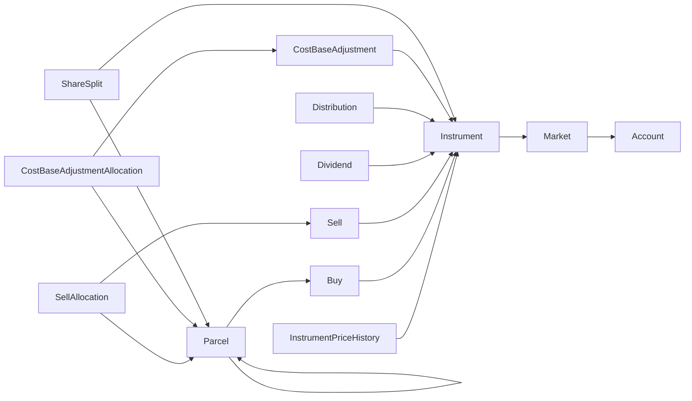
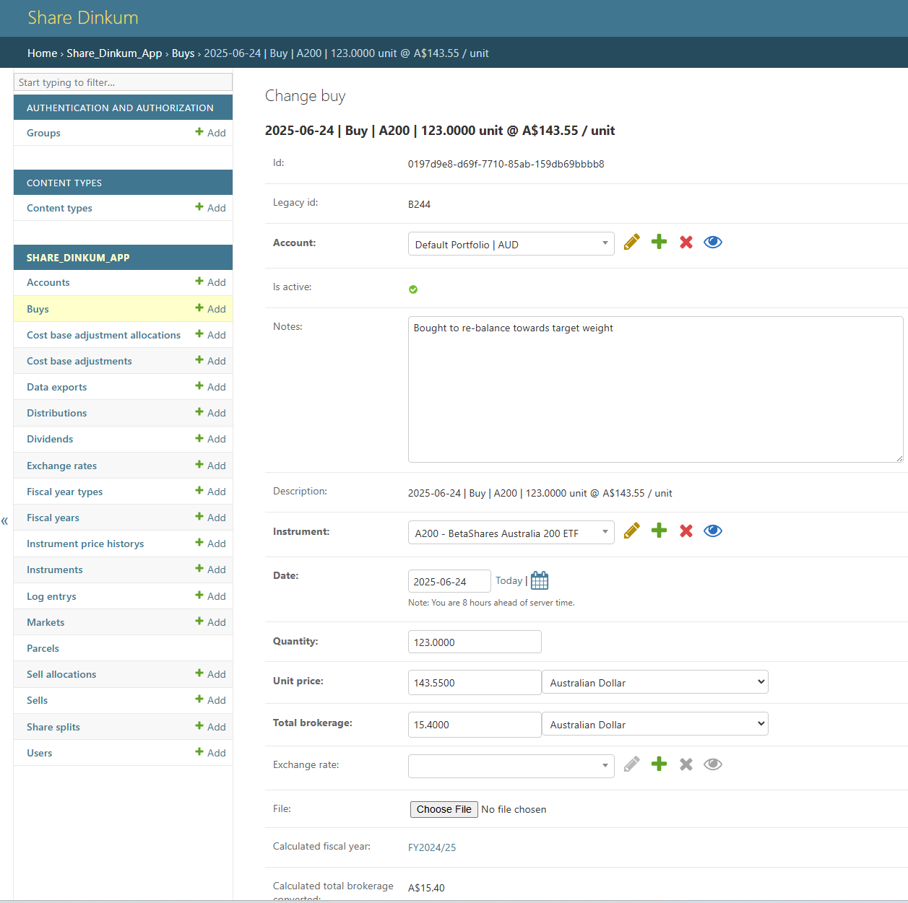
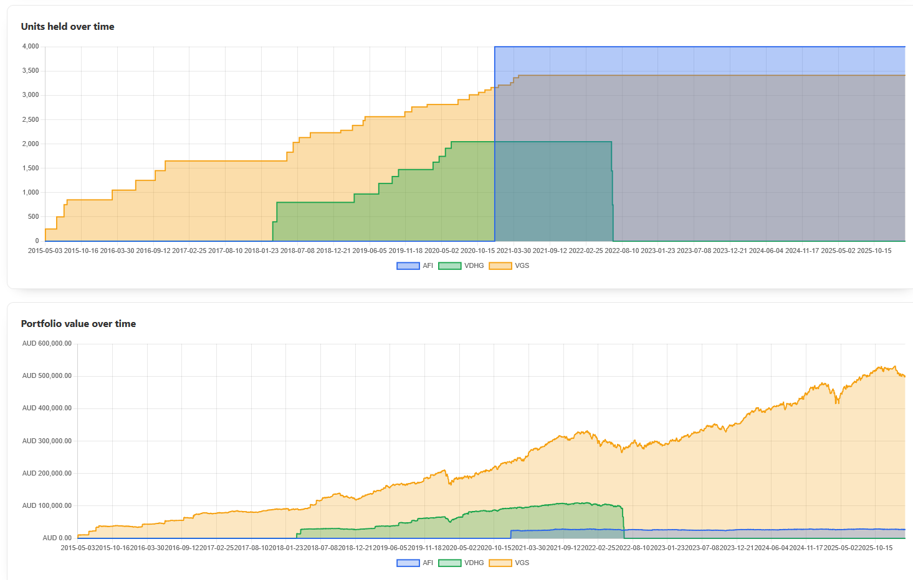
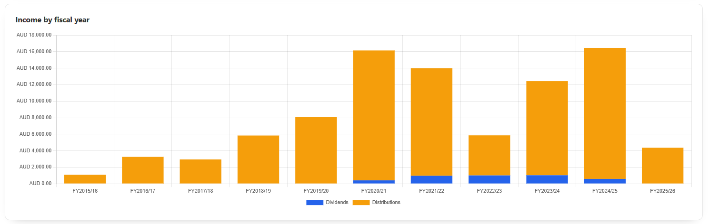
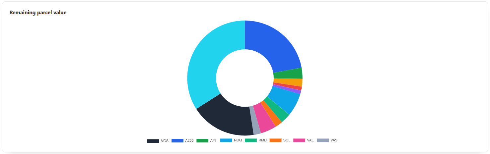
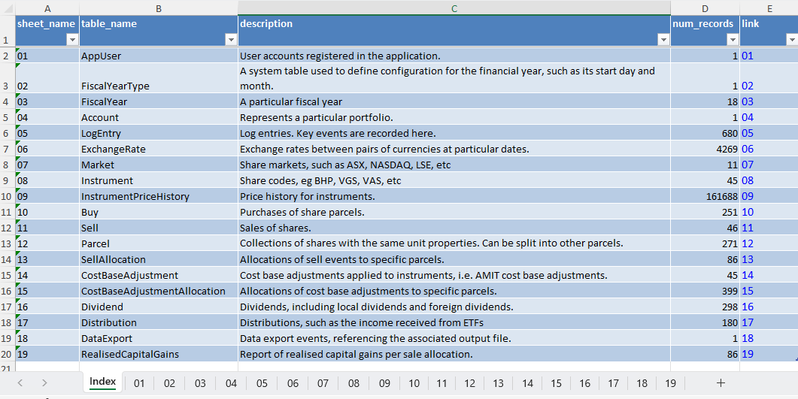

# Share Dinkum

**Share Dinkum** is a Django-based application for tracking shares, with a particular focus on Australian-specific tax and accounting considerations, such as franking credits and AMIT cost base adjustments.

Share Dinkum is free and open source.

## Work in progress

This project is currently under development. Contributions and feedback are welcome.

There may be bugs, and usage is entirely at your own risk. Please refer to the license file for more information.

---

## Core concepts

### Data entry

You can either enter items via the web interface or using the bulk import tool (from Excel). If you want to bulk import data, you create a **[DataImport]** object, attaching the template. If you want to export the data, you create a **[DataExport]** object. The data export output file can be imported again to update values.

### Data model / principal of operation

Each portfolio is represented by an **[Account]**. The account has a base currency and fiscal year configuration (Set up for Australia by default).

There are **[Market]**, eg ASX which contain **[Instrument]**, eg BHP or VDHG.

Each purchase of an instrument is a **[Buy]** object. You enter the quantity, unit price, and quantity. You can also attach a file and include any relevant notes. If you enter a buy in a different currency to your selected base curency, the system will lookup and store an appropriate **[ExchangeRate]** object for that particular date.

Each time you enter a **[Buy]**, the system creates an associated **[Parcel]**. A parcel represents a collection of shares with the same unit properties (purchase date, cost base per share).

You can enter forms of income such as **[Dividend]** and **[Distribution]**. According to the configured **[FiscalYearType]**, the income events will be classified into a particular **[FiscalYear]**

If you enter a **[Sell]**, this sale needs to be allocated against specific parcels. You can chose an algorithm to do this, either FIFO (First in First Out), LIFO (Last in First Out), MIN_CGT (Minimimise net capital gain). The **[Sell]** generates the requried **[SellAllocation]** objects and links them to the appropriate parcels. You can also chose to manually allocate the sells against parcels if you chose (generally you would only do this when importing legacy data).

Any time that a **[SellAllocation]** does not completely consume the target parcel, that parcel is bifurcated. That is, the original parcel is marked as inactive, and replaced by a 'sold' parcel, and an 'unsold' parcel. The original cost base is apportioned between them, and each of these parcels points to the parcel from which it was derived from. Each sell allocation represents a capital gain or loss, which are also allocated to a **[FiscalYear]**

Any time you enter an **[CostBaseAdjustment]**, i.e. AMIT cost base adjustment, the amount of the adjustment is automatically apportioned to all unsold **[Parcel]**, using a weighting of the quantity of shares * the proportion of the fiscal year held. The algorithm automatically creates the required **[CostBaseAdjustmentAllocation]** objects.

If you encounter a **[ShareSplit]** event, you enter the before and after units held, and this will replace the old parcels with new ones with the adjusted cost base and quantity. Any associated **[CostBaseAdjustmentAllocation]** objects are transferred from the old parcels to the new parcels.

If you save your **[Account]** object, you have the option to update your price history. This will incrementally historise the daily price for all of your shares, storing that into the **[InstrumentPriceHistory]** table.

### Simplified overview


```mermaid
flowchart LR
    Market --> Account
    Instrument --> Market
    InstrumentPriceHistory --> Instrument

    Buy --> Instrument
    Sell --> Instrument
    Dividend --> Instrument
    Distribution --> Instrument
    CostBaseAdjustment --> Instrument
    ShareSplit --> Instrument

    Parcel --> Buy
    Parcel --> Parcel
    SellAllocation --> Parcel
    SellAllocation --> Sell

    CostBaseAdjustmentAllocation --> CostBaseAdjustment
    CostBaseAdjustmentAllocation --> Parcel
    ShareSplit --> Parcel
```

*Not shown: AppUser, FiscalYearType, FiscalYear, ExchangeRate, CurrentExchangeRate, LogEntry, DataExport.*

For a full entity relationship diagram with fields and all relationships, see [Detailed data model](docs/data_model.md).

---

## Capital Gains Changes (not yet legislated)

The Australian Government has proposed changes to CGT taking effect from 1 July 2027. The changes are not yet legislated, but Share Dinkum is being designed to accommodate them so existing data continues to work once the rules apply.

See [Capital gains changes - implementation plan](docs/capital_gains_changes_plan.md) for the planned data-model and calculation changes.

---
## Example screenshots







(This is sample / fake data - TODO make it look more normal)



(Note, all the data is stored in a local database, so you can build your own BI dashboards by connecting to that datasource.)

---
## Setup instructions

These steps are written for Windows 10/11 using PowerShell, and work the same on macOS and Linux
except where noted. They should take about ten minutes.

### Prerequisites

You need two tools installed before you start. **You do not need to install Python separately**,
`uv` downloads the correct version (3.13) for you.

| Tool | What it is for | Install with `winget` | Or download |
|---|---|---|---|
| **Git** | Downloads the code | `winget install Git.Git` | [git-scm.com](https://git-scm.com/download/win) |
| **uv** | Manages Python and the dependencies | `winget install astral-sh.uv` | [docs.astral.sh/uv](https://docs.astral.sh/uv/getting-started/installation/) |

After installing, **close and reopen your terminal** so it picks up the new commands. Check both work:

```powershell
git --version
uv --version
```

### 1. Download the code

```powershell
git clone https://github.com/pretoriusdre/share-dinkum.git
cd share-dinkum
```

### 2. Install the dependencies

```powershell
uv sync
```

This creates a `.venv` folder, downloads Python 3.13 if you do not already have it, and installs
the exact package versions pinned in `uv.lock`.

You never need to "activate" the virtual environment. Every command below uses `uv run`, which
takes care of it for you.

### 3. Create your settings file

```powershell
cd share_dinkum_proj
copy .env.sample .env
```

On macOS/Linux use `cp .env.sample .env` instead.

The defaults work as-is and use a local SQLite database file, so there is nothing else to configure.
If you want to, open `.env` and replace `SECRET_KEY=__REPLACE_ME__` with any long random string.

### 4. Create the database

From the repository root (`cd ..` if you are still in `share_dinkum_proj`):

```powershell
uv run dev migrate
```

### 5. Create your login

```powershell
uv run dev createsuperuser
```

Enter a username and password when prompted, and remember them; you will use them to log in. The
password is not shown as you type, which is normal.

### 6. Start the app

```powershell
uv run dev
```

Then open **http://127.0.0.1:8000/** in your browser and log in with the account from step 5.

Leave the terminal window open while you use the app. Press `Ctrl+C` there to stop the server.

### Troubleshooting

| Problem | Fix |
|---|---|
| `git` or `uv` is not recognised | Close and reopen the terminal after installing, so `PATH` updates. |
| `Activate.ps1 cannot be loaded because running scripts is disabled` | You do not need to activate anything, use the `uv run` commands above. |
| `That port is already in use` | Something else is on port 8000. Run `uv run dev runserver 8001` and browse to port 8001. |
| `No such file or directory: manage.py` | `uv run dev` works from the repository root. Use `cd` to get back there. |
| Browser shows "DisallowedHost" | Use `127.0.0.1`, not your machine name. |

Any other command can be passed straight through, so `uv run dev test share_dinkum_app` runs the
test suite and `uv run dev collectstatic` collects static files.

---

## Updating to a newer version

This project is under active development, so it is worth updating from time to time.

**Stop the server first**, with `Ctrl+C` in the terminal running it. Everything below assumes it is
not running: copying a database while the app is writing to it can capture an incomplete file.

**Then back up your data.** Your data is two things: the database `share_dinkum_proj/db.sqlite3`,
and `share_dinkum_proj/media`, which holds any documents you attached to a transaction. Copy both,
to somewhere outside the project folder:

```powershell
$backup = "$env:USERPROFILE\share-dinkum-backups\$(Get-Date -Format yyyy-MM-dd)"
New-Item -ItemType Directory -Path $backup -Force
Copy-Item share_dinkum_proj\db.sqlite3 $backup
Copy-Item share_dinkum_proj\media $backup -Recurse
```

To roll back later, stop the server and copy both back over the originals.

If you use the import notebook, its `backup()` helper is a better option: it captures the database
and media in the same way, adds an Excel export of every account, keeps the five most recent copies,
and takes a consistent database snapshot even if the server happens to be running.

**Now update.** From the repository root:

```powershell
git pull
uv sync
uv run dev migrate
```

Each of those three matters. `git pull` brings the new code, `uv sync` installs any dependencies
that were added or changed, and `uv run dev migrate` applies any changes to the database structure.
Skipping the last one typically shows up as an error mentioning a missing column or table.

Start the app again with `uv run dev`.

Your own data is never touched by `git pull`. The database, the `media` folder and your `.env` file are all excluded from the repository.

---

## Optional: Data Import Instructions

You can bulk load your share data from Excel using the provided tools.

### 1. Prepare the Data Loading Template

Navigate to the import directory:

```bash
cd share_dinkum_proj/share_dinkum_app/import_data
```

Copy the public template and rename it:

- Windows (PowerShell or Command Prompt):
  ```powershell
  copy data_import_template_public.xlsx data_import_template_private.xlsx
  ```
- macOS/Linux:
  ```bash
  cp data_import_template_public.xlsx data_import_template_private.xlsx
  ```


### 2. Edit the Template

Fill in your personal share data in `data_import_template_private.xlsx` using Excel.

### 3. Run the Bulk Load Script

Once your data is ready:

Open `share_dinkum_proj/data_import.ipynb` and run the cells in order. Either of these works:

- **In VS Code** (simplest on Windows): install the *Python* and *Jupyter* extensions, open the
  file, and select the `.venv` interpreter when prompted. Everything it needs is already installed.
- **In your browser**, without installing Jupyter permanently:

    ```powershell
    uv run --with notebook jupyter notebook share_dinkum_proj/data_import.ipynb
    ```

The notebook clears any existing data before loading, so only run it when that is what you want.

---

## Contributing

Contributions are welcome. To contribute:

1. Fork the repository.
2. Create a new feature branch: `git checkout -b feature-name`
3. Make your changes and commit: `git commit -m "Describe your changes"`
4. Push your changes: `git push origin feature-name`
5. Open a pull request on GitHub

---

## License

This project is licensed under the GNU Affero General Public License (AGPL). You are free to use, modify, and distribute the software under the terms of the AGPL.

**Limitations of Liability**  
This software is provided "as is" without warranty of any kind, either express or implied. The authors are not liable for any claims or damages resulting from its use.

**Usage at Your Own Risk**  
By using this software, you acknowledge that it is your responsibility to ensure it meets your needs. The authors disclaim responsibility for any losses or issues arising from its use.

For full details, see the `LICENSE` file.
