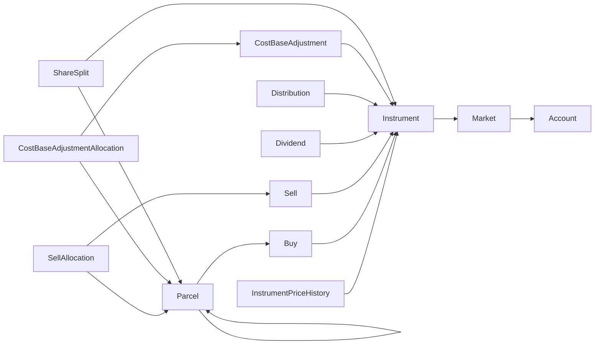
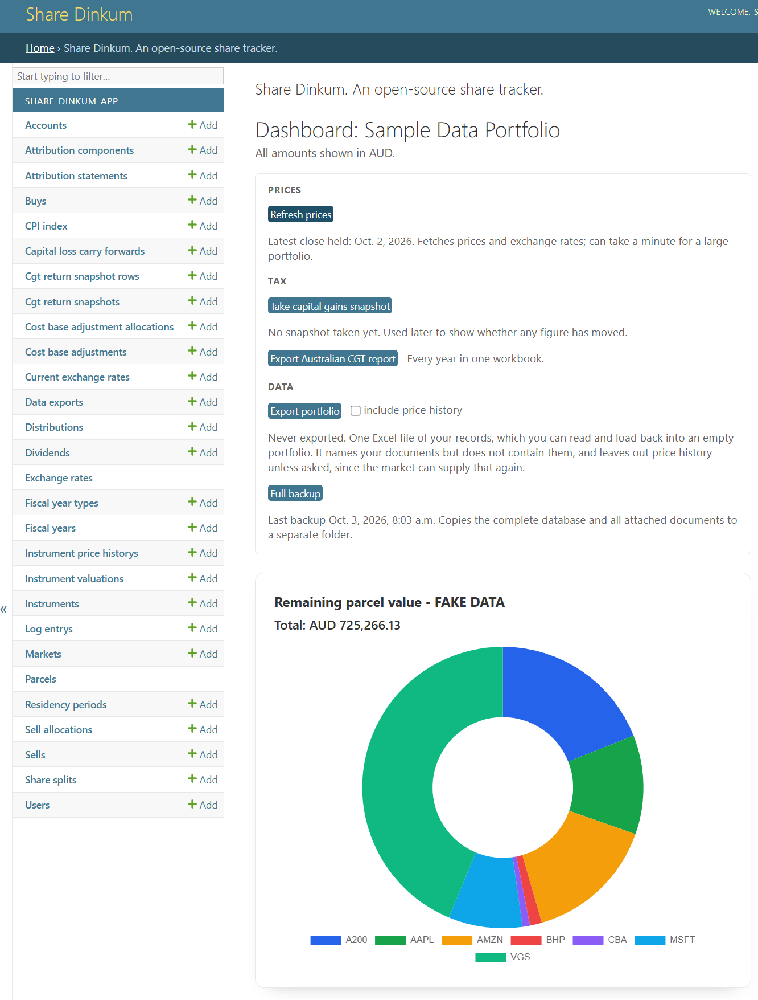
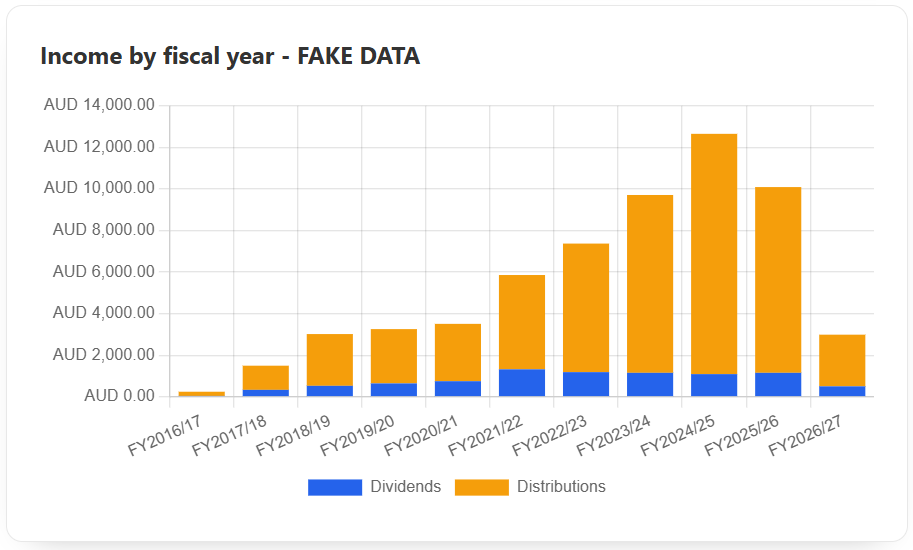
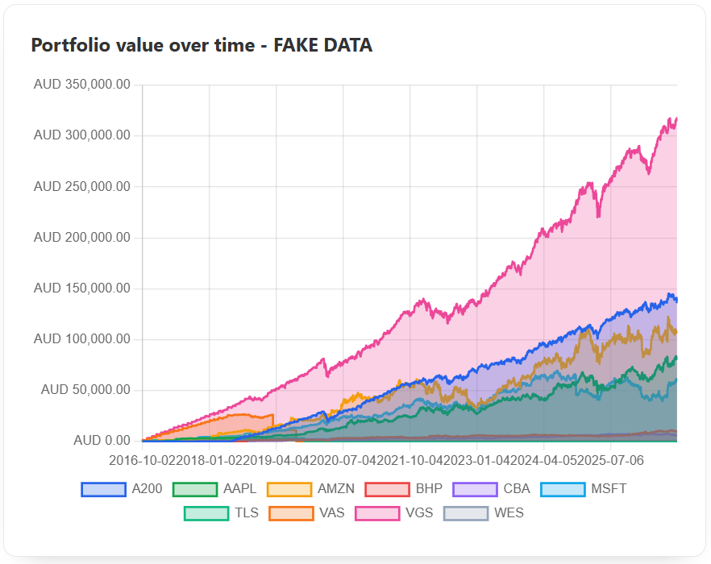
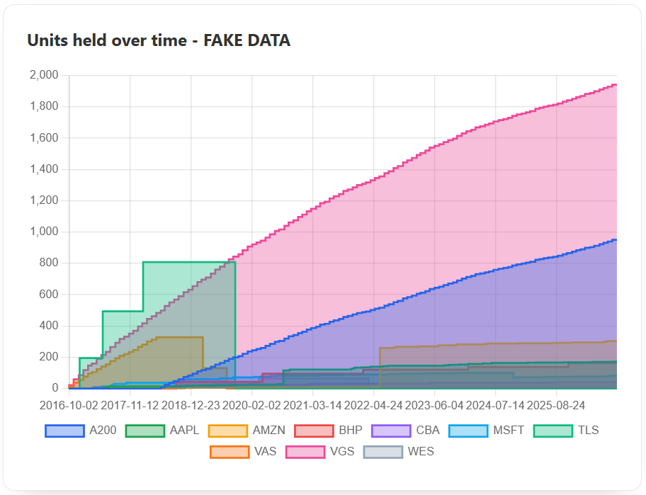
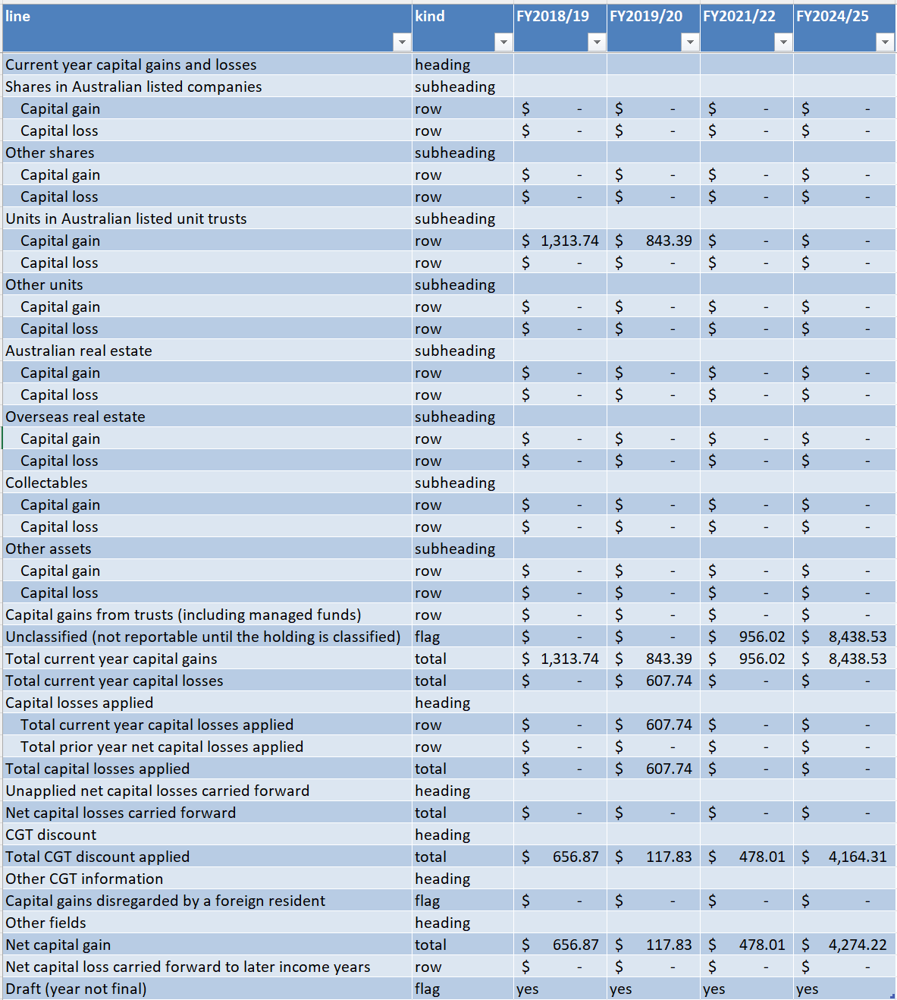
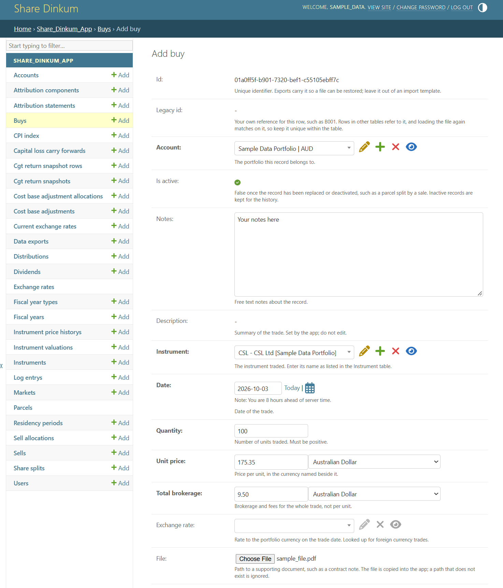
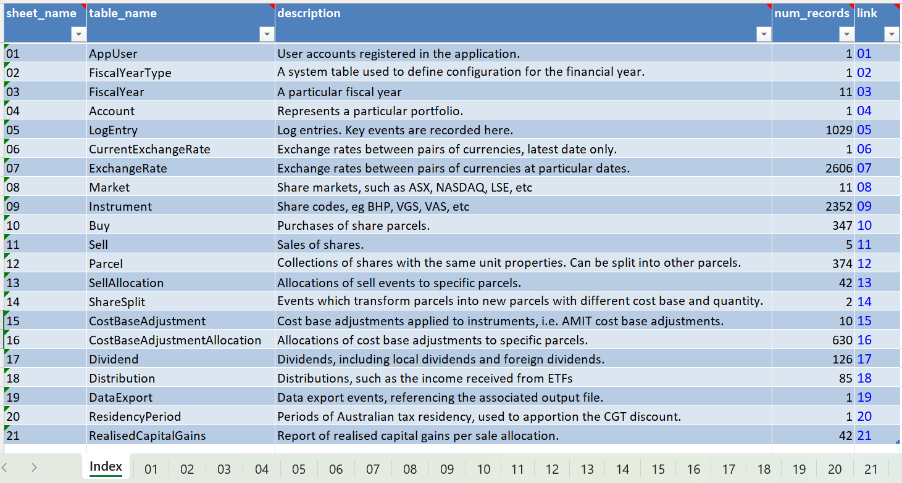

# Share Dinkum

**Share Dinkum** is a free, open-source app for tracking investment portfolios. It runs on your own
computer and opens in your browser. It handles shares, ETFs and funds on any exchange and in any
currency, plus unlisted holdings, and works out the Australian tax on them: franking credits, AMIT
cost base adjustments, foreign income and capital gains, including the 2027 changes.

**Your data stays yours.** It's stored on your own computer, not someone else's server.
**Export portfolio** on the dashboard writes all of it to one Excel workbook with every column
clearly explained, so you can read it, load it back in, or move to another tool if you ever need to.
**Full backup** also copies your attached documents. Every feature is free, with no paid tier, and
the AGPL licence keeps the code open for anyone to use and improve.

## Development status

This project is under active development, and contributions and feedback are welcome.

Share Dinkum is not tax advice. Check its figures against your statements, or with a tax agent, before relying on them in a return.

Usage is governed by the [license](#license).

See [CHANGELOG.md](CHANGELOG.md) for what has changed in each release.

---

## Core concepts

### Data entry

Enter records in the web interface, or in bulk from Excel using the `data_import.ipynb` notebook,
which loads one Excel file into one portfolio (see [Data import instructions](#optional-data-import-instructions)).
To export, create a **[DataExport]**. An export can be loaded back into the portfolio it came from to
update it.

### Data model / principle of operation

Each portfolio is an **[Account]**, with a base currency, a fiscal year configuration (Australian by
default) and tax settings.

A **[Market]**, eg ASX, contains **[Instrument]** objects, eg BHP or VDHG.

Each purchase is a **[Buy]**: date, quantity, unit price and brokerage, plus an optional file and
notes. A buy in a currency other than the base currency gets an **[ExchangeRate]** for its date; a
day with no quote (a weekend or holiday) takes the last rate before it.

Each **[Buy]** creates a **[Parcel]**: a holding of shares with the same purchase date and cost base
per share.

Income is entered as **[Dividend]** and **[Distribution]** objects, and classified into a
**[FiscalYear]** according to the account's **[FiscalYearType]**.

A **[Sell]** is allocated against parcels by a strategy: FIFO (first in, first out), LIFO (last in,
first out), MIN_CGT (minimise net capital gain) or MANUAL (you create the allocations, usually only
when importing legacy data). The sell creates **[SellAllocation]** objects linking it to parcels.
Each allocation is a capital gain or loss, classified into a **[FiscalYear]**.

When a **[SellAllocation]** does not consume a whole parcel, the parcel is bifurcated: it is marked
inactive and replaced by a 'sold' and an 'unsold' parcel, which share its cost base and point back to
it.

An AMIT **[CostBaseAdjustment]** is apportioned to the unsold parcels, weighted by quantity times
days held in the fiscal year, as **[CostBaseAdjustmentAllocation]** objects. You can also allocate it
manually.

A **[ShareSplit]**, dated on its ex-date, takes the units held before and after. It replaces the
affected parcels with new ones at the adjusted quantity and cost base, and moves their cost base
adjustment allocations across.

Records that others were derived from cannot have their key fields changed once entered (delete and
re-enter instead), and a trade or split dated before one already applied is refused.

Prices are stored as traded on the day in **[InstrumentPriceHistory]**. Use **Refresh prices** on
the dashboard to fetch new prices and exchange rates. If the dashboard reports a data problem, run
`uv run dev repair_portfolio_data` (`--dry-run` only reports).

Further tables hold tax facts the reports read, such as residency periods and loss carry-forwards:
see [Capital gains tax](#capital-gains-tax). Every table is in the
[detailed data model](docs/data_model.md).

### Simplified overview


```mermaid
flowchart LR
    Market --> Account
    Instrument --> Market
    InstrumentPriceHistory --> Instrument
    Buy --> Instrument
    Sell --> Instrument
    Dividend --> Instrument
    Distribution --> Instrument
    CostBaseAdjustment --> Instrument
    ShareSplit --> Instrument

    Parcel --> Buy
    Parcel --> Parcel
    SellAllocation --> Parcel
    SellAllocation --> Sell

    CostBaseAdjustmentAllocation --> CostBaseAdjustment
    CostBaseAdjustmentAllocation --> Parcel
    ShareSplit --> Parcel
```

*Not shown: AppUser, FiscalYearType, FiscalYear, ExchangeRate, CurrentExchangeRate, LogEntry,
DataExport, and the capital gains tables below.*

For the full entity relationship diagram with fields, see [Detailed data model](docs/data_model.md).

---

## Capital gains tax

Capital gains reports are worked out from your transactions when you run them, so a correction flows
through to every report. The account's **taxpayer type** sets the discount: half for an individual
or trust, a third for a complying super fund, none for a company.

The 2027 changes are legislated (Treasury Laws Amendment (Tax Reform No. 1) Act 2026) and apply to
CGT events from 1 July 2027. Turn on **Model 2027 regime** in the account's tax settings to apply
them. A holding bought before and sold after 1 July 2027 is split: the discount on growth to
30 June 2027, CPI indexation after.

Eight tables support this: residency periods (discount apportionment, TAP / NTAP), instrument
valuations (deemed disposals), managed fund attribution statements and their components, capital
loss carry-forwards, CGT return snapshots and their rows, and CPI figures. Instruments also gain a
legal form, which drives the CGT schedule report.

Related commands (run with `uv run dev`): `load_cpi`, `capture_cutover_valuations`,
`suggest_instrument_classification` and `capture_cgt_snapshot`.

- [docs/capital_gains_models.md](docs/capital_gains_models.md): what each table is for and the order
  to fill them in.
- [CHANGELOG.md](CHANGELOG.md), version 0.4.0: the full list of behaviour.

---

## Example screenshots

All screenshots use the fake sample portfolio.

### Dashboard

The dashboard has the actions (refresh prices, CGT snapshot and report, income report, export, backup) and charts
of the portfolio.









### CGT report

The Australian CGT report sets out each year in the layout of the tax return's CGT schedule.



### Income report

The Australian income report sets out each year's dividends and trust income by return label: items
11 (dividends), 13 (trusts, from each fund's annual statement) and 20 (foreign income). Only income
received as an Australian resident counts. Payments while a foreign resident are listed separately,
with what was withheld.

### Data management
Buy Screen:

Data Export:


All data is stored in a local database, so you can also connect your own BI tools to it.

---

## Setup instructions

These steps are written for Windows 10/11 using PowerShell, and work the same on macOS and Linux
except where noted. They take about ten minutes.

### Prerequisites

You need two tools. **You do not need to install Python separately**: `uv` downloads the correct
version (3.13) for you.

| Tool | What it is for | Install with `winget` | Or download |
|---|---|---|---|
| **Git** | Downloads the code | `winget install Git.Git` | [git-scm.com](https://git-scm.com/download/win) |
| **uv** | Manages Python and the dependencies | `winget install astral-sh.uv` | [docs.astral.sh/uv](https://docs.astral.sh/uv/getting-started/installation/) |

After installing, **close and reopen your terminal** so it picks up the new commands. Check both work:

```powershell
git --version
uv --version
```

### 1. Download the code

```powershell
git clone https://github.com/pretoriusdre/share-dinkum.git
cd share-dinkum
```

### 2. Install the dependencies

```powershell
uv sync
```

This creates a `.venv` folder, downloads Python 3.13 if needed, and installs the package versions
pinned in `uv.lock`. You never need to activate the virtual environment: every command below uses
`uv run`, which does it for you.

### 3. Create your settings file

```powershell
cd share_dinkum_proj
copy .env.sample .env
```

On macOS/Linux use `cp .env.sample .env` instead.

The defaults work as-is, using a local SQLite database. Optionally, open `.env` and replace
`SECRET_KEY=__REPLACE_ME__` with any long random string.

### 4. Create the database

From the repository root (`cd ..` if you are still in `share_dinkum_proj`):

```powershell
uv run dev migrate
```

### 5. Start the app

```powershell
uv run dev
```

Then open **http://127.0.0.1:8000/** in your browser. There is no login: the app runs on your own
machine against your own database, so it signs you in automatically. If you ever make an install
reachable by anyone else, put `LOCAL_AUTO_LOGIN=False` in `.env` and create an account with
`uv run dev createsuperuser`, and the normal login page comes back.

Leave the terminal open while you use the app. Press `Ctrl+C` there to stop the server.

### Troubleshooting

| Problem | Fix |
|---|---|
| `git` or `uv` is not recognised | Close and reopen the terminal after installing, so `PATH` updates. |
| `Activate.ps1 cannot be loaded because running scripts is disabled` | You do not need to activate anything, use the `uv run` commands above. |
| `That port is already in use` | Something else is on port 8000. Run `uv run dev runserver 8001` and browse to port 8001. |
| `No such file or directory: manage.py` | `uv run dev` works from the repository root. Use `cd` to get back there. |
| Browser shows "DisallowedHost" | Use `127.0.0.1`, not your machine name. |
| Updating stops with `Your local changes to the following files would be overwritten by merge` | You have changed a file that the update also changes, most often `data_import.ipynb` because running it rewrites its saved output. Copy it elsewhere if you want to keep your version, then `git checkout -- share_dinkum_proj/data_import.ipynb` and update again. Working in your own `data_import_private.ipynb` copy avoids this. |

Any other Django command can be passed straight through, so `uv run dev test share_dinkum_app` runs
the test suite and `uv run dev collectstatic` collects static files.

---

## Updating to a newer version

The dashboard shows the installed version next to Recent actions. Once a day it checks GitHub for a
newer [release](https://github.com/pretoriusdre/share-dinkum/releases) and, if there is one, says so
with a link to what changed. Offline, it says nothing. [CHANGELOG.md](CHANGELOG.md) has the full
history, including any one-off steps after an upgrade.

To update, stop the server with `Ctrl+C`, then from the repository root run:

```powershell
uv run update
```

That backs up your data, fetches the latest code, installs any new dependencies, and applies any
database changes. Then start the app again with `uv run dev`.

The backup goes to `~/share-dinkum-backups/main/` (the five most recent are kept) and covers both
parts of your data: the database `share_dinkum_proj/db.sqlite3`, and `share_dinkum_proj/media`, which
holds documents attached to transactions. To roll back, stop the server and copy both back. Neither,
nor your `.env`, is part of the repository, so an update never changes them.

If you have edited any of the project's own files, the update stops before changing anything and
lists them, so your edits cannot be lost in a merge. Commit or discard them and run it again.

<details>
<summary>Running the steps individually</summary>

`uv run update` is equivalent to backing up your data and then running:

```powershell
git pull
uv sync
uv run dev migrate
```

`git pull` brings the new code, `uv sync` installs added or changed dependencies, and
`uv run dev migrate` applies database changes. Skipping the last one typically shows up as an error
about a missing column or table.

</details>

---

## Optional: Data import instructions

You can bulk load your share data from Excel.

### 1. Prepare the template

From the repository root, generate an empty template:

```powershell
uv run dev make_import_template
```

That writes `share_dinkum_proj/share_dinkum_app/import_data/data_import_template_blank.xlsx`, with
every sheet and column the loader understands. Each column header has a note saying what it is,
whether it is required, and what a blank means; columns with a fixed set of values have a dropdown.

Take one copy per portfolio:

- Windows (PowerShell or Command Prompt):
  ```powershell
  cd share_dinkum_proj\share_dinkum_app\import_data
  copy data_import_template_blank.xlsx data_import_template_private.xlsx
  ```
- macOS/Linux:
  ```bash
  cd share_dinkum_proj/share_dinkum_app/import_data
  cp data_import_template_blank.xlsx data_import_template_private.xlsx
  ```

Anything ending in `_private.xlsx` is excluded from the repository, so updates leave your files alone.

The sheets with a grey tab (residency periods, instrument valuations, capital loss carry-forwards and
managed fund annual statements) are optional. Leave them empty, or enter that information in the app
later. CPI figures are not part of the file: load them with `uv run dev load_cpi`.

For worked examples, `data_import_template_public.xlsx` is the same template filled with a fake
10-year portfolio (`uv run dev make_fake_data --force` rebuilds it).

### 2. Fill in the template

Enter your share data in `data_import_template_private.xlsx` using Excel.

### 3. Run the import notebook

Take your own copy of the notebook, as you did with the template. Your `_private` copy is excluded
from the repository, so updates leave it alone. Run that one, not the original.

From the repository root:

- Windows (PowerShell or Command Prompt):
  ```powershell
  copy share_dinkum_proj\data_import.ipynb share_dinkum_proj\data_import_private.ipynb
  ```
- macOS/Linux:
  ```bash
  cp share_dinkum_proj/data_import.ipynb share_dinkum_proj/data_import_private.ipynb
  ```

Open `share_dinkum_proj/data_import_private.ipynb` and run the cells in order, either:

- **In VS Code** (simplest on Windows): install the *Python* and *Jupyter* extensions, open the
  file, and select the `.venv` interpreter when prompted.
- **In your browser**, without installing Jupyter permanently:

    ```powershell
    uv run --with notebook jupyter notebook share_dinkum_proj/data_import_private.ipynb
    ```

Loading only adds to or updates the portfolio a file is listed against, as a single transaction: a
file that fails part way leaves nothing behind. It is safe to run again after a new year of trades.
The one cell that deletes anything is at the bottom of the notebook under **Danger zone**, commented
out. It wipes every portfolio, not just one.

### Multiple portfolios

Each Excel file loads into exactly one portfolio. List them in the `portfolios` list near the top of
your `data_import_private.ipynb`:

```python
portfolios = [
    {
        'description': 'Default Portfolio',
        'input_file': import_data_folder / 'data_import_template_private.xlsx',
        'taxpayer_type': 'INDIVIDUAL',     # optional: or TRUST, PARTNERSHIP, COMPANY, SMSF
        'tax_settings_reviewed': True,     # optional: silences the tax settings warning
    },
    {
        'description': "Partner's Portfolio",
        'input_file': import_data_folder / 'partner_private.xlsx',
    },
]
```

Portfolios are matched by description, so keep them distinct. Adding a portfolio and running again
loads only the new one. `taxpayer_type` and `tax_settings_reviewed` apply only when the portfolio is
first created; you can also set them in the app.

### Loading a file again

- Rows are matched on `id`, then `legacy_id`, then the table's unique fields (such as a market's
  code), and otherwise added. A corrected file therefore updates rows rather than duplicating them.
- A blank cell leaves the stored value unchanged.
- A transaction row with no `id` or `legacy_id` is refused once the portfolio has rows of that kind,
  since it cannot be matched and would be added twice.
- A **[DataExport]** file can be loaded back into the portfolio it came from, but not into a
  different one: its rows carry their identity, so loading it elsewhere would move them rather than
  copy them.

---

## Contributing

Contributions are welcome. To contribute:

1. Fork the repository.
2. Create a new feature branch: `git checkout -b feature-name`
3. Make your changes and commit: `git commit -m "Describe your changes"`
4. Push your changes: `git push origin feature-name`
5. Open a pull request on GitHub

---

## License

This project is licensed under the GNU Affero General Public License (AGPL). You are free to use, modify, and distribute the software under the terms of the AGPL.

**Limitations of Liability**  
This software is provided "as is" without warranty of any kind, either express or implied. The authors are not liable for any claims or damages resulting from its use.

**Usage at Your Own Risk**  
By using this software, you acknowledge that it is your responsibility to ensure it meets your needs. The authors disclaim responsibility for any losses or issues arising from its use.

For full details, see the [LICENSE file](LICENSE).
