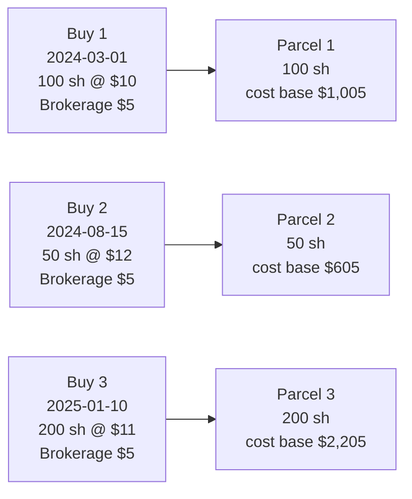
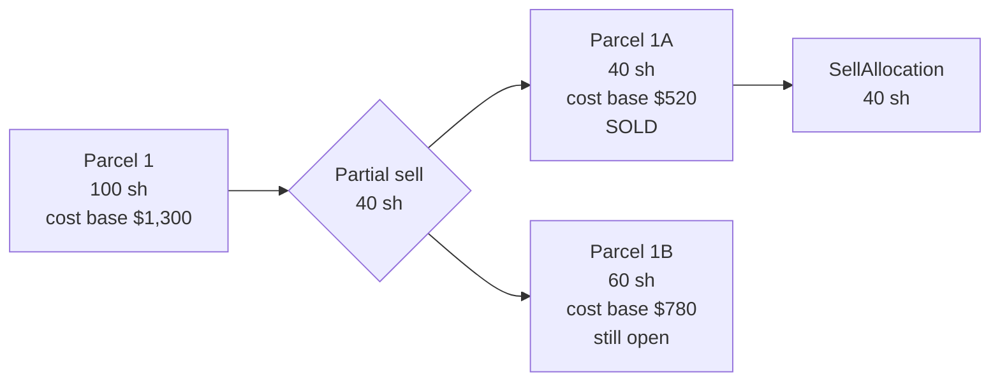
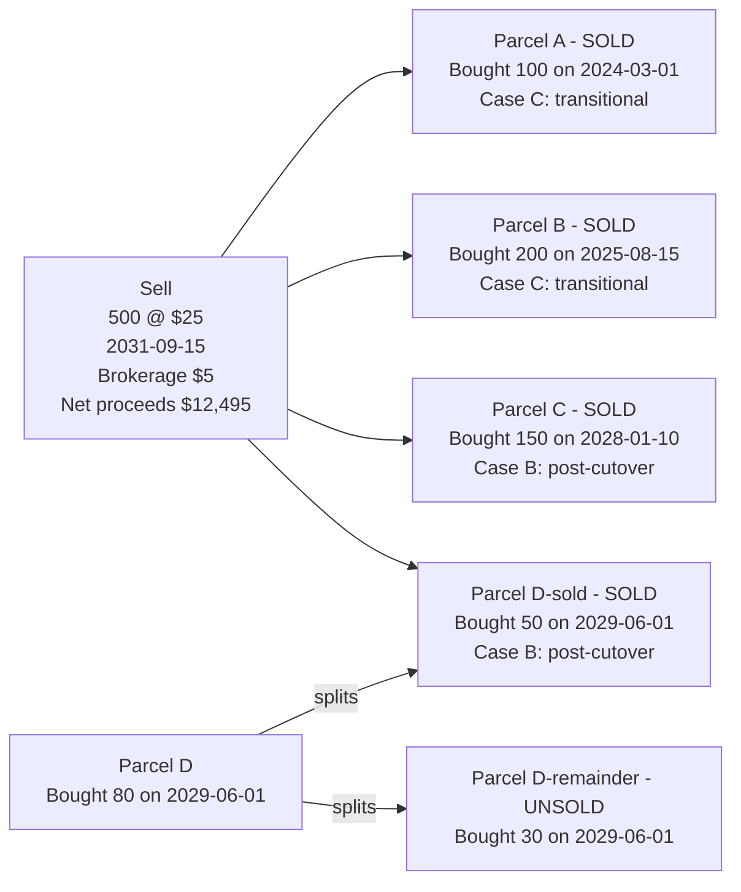
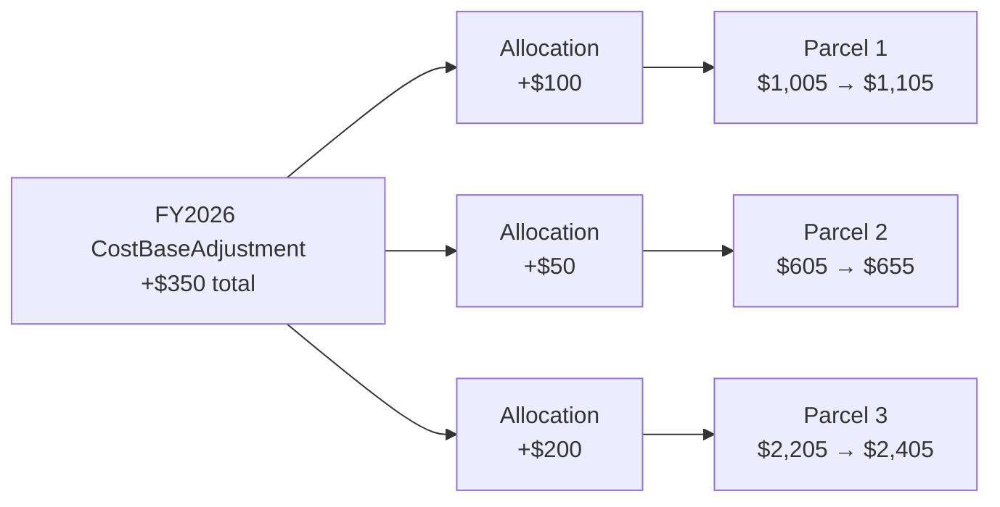
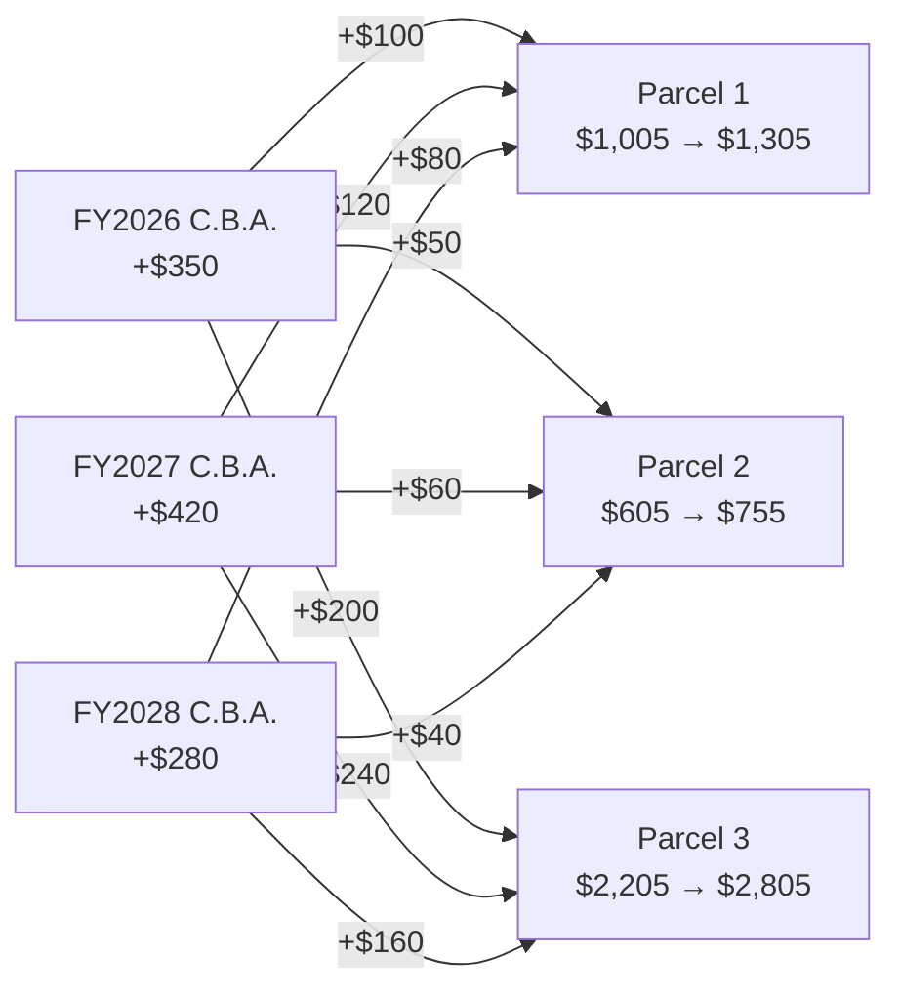
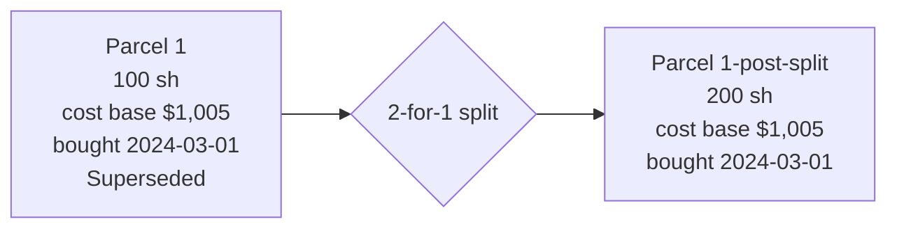
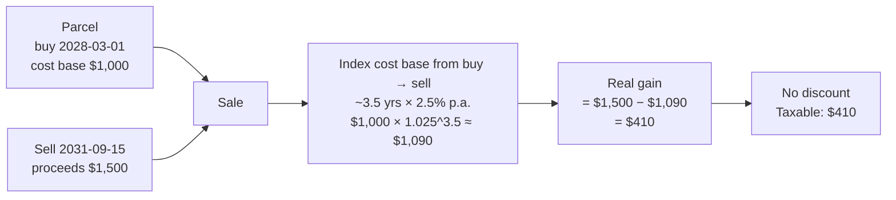
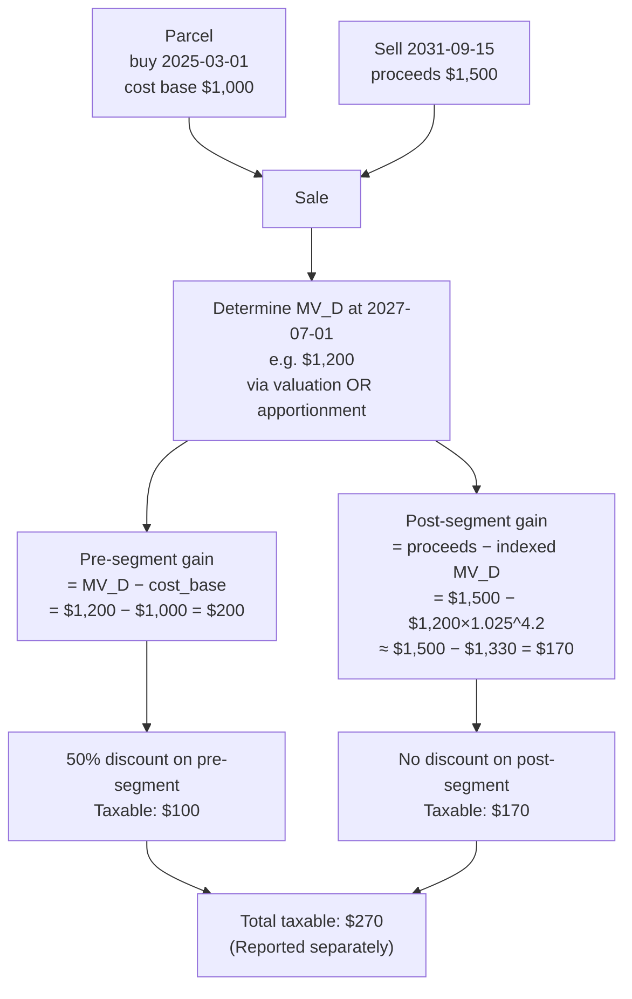
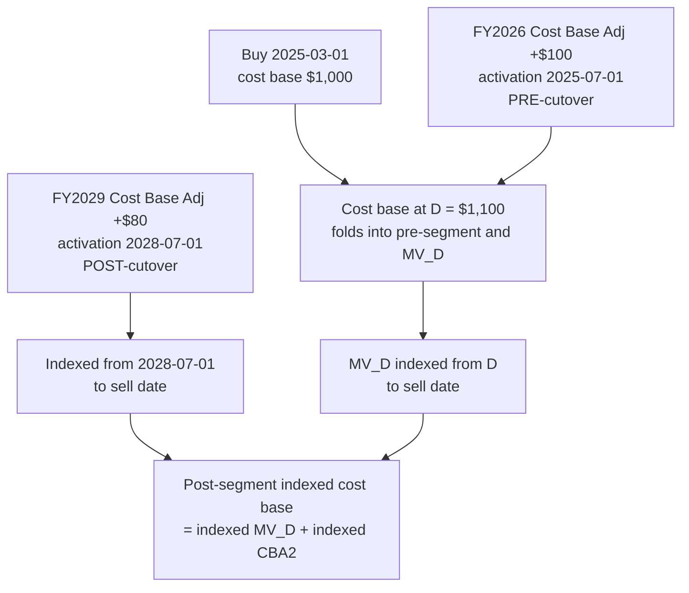
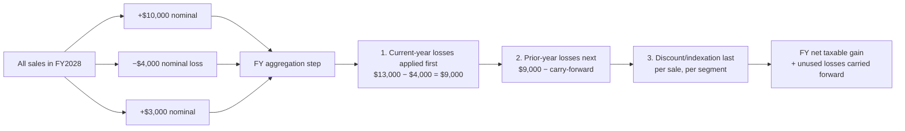

# The 2027 CGT changes are really complex

I'm trying to wrap my head around the Federal Budget's proposed CGT changes. The Budget paper has a few worked examples ("Zoe buys $100 of shares, sells for $125, here's the indexed gain"), which makes it sound like a one-line formula change. The reality is a lot more complicated than that, and I think most people will struggle with the calculations.

For context: I maintain an open source portfolio tracker focused on Australian shares ([share-dinkum on GitHub](https://github.com/pretoriusdre/share-dinkum)). I'm planning out an implementation strategy (though things might yet change). I thought I'd include some simplified parts of it here for discussion purposes.

---

## Part 1: The current situation

Before getting into what's changing, it's worth setting out how share portfolios are tracked for CGT today. A lot of the complexity in the proposed reforms comes from how it interacts with the existing record-keeping model, not from the headline rule itself.

### Background: Parcel tracking

Every Buy creates an independent **Parcel** with its own cost base and acquisition date. Parcels are the unit of accounting for CGT. Every later transaction (sells, AMIT adjustments, etc.) must tracked against specific parcels.

If you DCA into an ETF monthly, ten years of buying creates ~120 separate parcels, each one independently tracked. Independent parcel tracking is necessary because every parcel has its own holding period, its own cost base, and under the proposed changes, its own indexation factor.

### Background: Parcel splitting

If a sell only consumes *part* of a parcel, the parcel splits into a "sold" portion and an "unsold" portion. Each half keeps its own future. The unsold portion retains the original acquisition date, which matters for any later sale or AMIT allocation.

The remainder is *not* a new parcel for tax purposes. It inherits the original acquisition date. This becomes important under the transitional rules, where the buy date determines whether the discount or indexation applies.

### Background: One sale, many parcels

A single sale rarely maps one-to-one with a single parcel. If you sell 500 shares from an ETF you've been accumulating monthly, that sale could be allocated across multiple parcels, with the last parcel typically only partially consumed, leaving a small remainder (which then splits as above).

The selection of parcels is up to you. Specific parcels, FIFO, LIFO, or aiming to minimise CGT. All are valid, but you need to keep records of your choice.

Each sale allocation gets its own independent tax treatment: its own acquisition date, its own holding period, and (under the new regime) its own indexation factor and Case A/B/C classification. Combine this with 120 parcels from a decade of monthly DCA, and one decent-sized sale produces a fan-out of independent sub-calculations that all have to be summed at the bottom.

### Background: Cost base adjustments (AMIT)

If you hold Australian ETFs or managed funds, you get annual **AMIT statements** that adjust the cost base of each parcel you held during the year. Upward when the fund attributed more taxable income than it distributed, downward when the reverse.

A single AMIT statement is apportioned across every parcel held during the relevant fiscal year. I split the adjustment according to a weigthing of (quantity of shares in each parcel) x (days of the financial year the parcel was held).

Each allocation is date-stamped with the start of the fiscal year it relates to. This date is irrelevant today, but is likely to become critical once indexation enters the picture.

Adjustments stack over successive fiscal years. The cost base of a parcel at any point in time is the original buy price plus all adjustments active up to that point:

Ten years of monthly buys is 120 parcels; a single AMIT statement then has to be split across all 120, and that happens again every year. A long-running accumulation can easily generate *thousands* of cost base adjustment allocations over its life. The complexity of this adjustment process is what motivated me to migrate my share tracking from Excel to a database tool.

### Background: Splits and consolidations

Corporate actions occasionally change the *number* of shares you hold without changing what you actually own. A **share split** (e.g. 2-for-1) multiplies your share count; a **consolidation** (reverse split, e.g. 1-for-5) divides it. Neither is a CGT event. There's no disposal, so no gain or loss to report.

What changes is the *shape* of each parcel. Every parcel held at the effective date is rescaled by the same factor: the total cost base is unchanged, just spread across a different number of shares. The acquisition date carries through untouched, which matters for the holding period and (under the new regime) the indexation start date.

For record keeping clarity, I think it is clearer to supersede/ cancel existing parcels, replacing them with new ones.

Only the quantity moves (and therefore the per-share cost; here $10.05 becomes $5.025). Because cost base and acquisition date are preserved, a split is invisible to the Case A/B/C classification: a parcel that was transitional before the split is still transitional after it.

If you are creating new parcels to replace the ones which are split/consolidated, any cost base adjustment allocations need to be moved to the new parcel.

### Background: Prior year losses

Today, capital losses are pretty easy to deal with. You can mentally net your gains and losses for the year, carry forward any unused losses, and apply 50% to the discount-eligible portion of the result. There's no real ordering question: the discount applies to the *net* gain, so it doesn't matter whether a loss is offset against a discount-eligible gain or a non-discount gain.

The bookkeeping is essentially: total gains − total losses − prior-year carry-forward = net gain. Then halve it (if eligible). Whatever wasn't used becomes next year's carry-forward.

---

## Part 2: The proposed changes

### Headline rules

Effective `D = 1 July 2027`:

1. **50% CGT discount** is abolished for new acquisitions and replaced with **cost-base indexation** (CPI, mirroring the pre-1999 regime).
2. A **transitional rule** (grandfathering) for assets bought before `D` and sold after: the gain splits into a pre-`D` portion (50% discount) and a post-`D` portion (indexed).
3. A **30% minimum effective tax rate** on real capital gains, applied by the ATO at assessment time. Out of scope in this discussion.

Three cases fall out of (1) and (2):

| Case | Buy date | Sell date | Treatment |
|---|---|---|---|
| **A** | any | < `D` | Unchanged. Current regime. |
| **B** | &ge; `D` | &ge; `D` | New regime only. Indexed cost base, no discount. |
| **C** | < `D` | &ge; `D` | Transitional: pre-segment (discount eligible) **+** post-segment (indexed). |

Case C is particularly tricky and it's going to be the dominant case for *years* after the cutover because most of us here are holding assets bought well before 2027.

### Case B: Pure indexation

This is the one the Budget paper's worked examples walk through. Worth noting: the Budget *policy text* says "indexation using CPI", but **every worked example uses a flat 2.5% per annum** ("Inflation is 2.5 per cent each year Zoe holds the assets", same for David, Ben and Kate). So we don't actually know yet whether the legislation will use actual published CPI figures or a fixed statutory rate (e.g. the 2.5% the examples use).

### Case C: Transitional segmentation

This is the case that **breaks the simple "halve the gain" model**. One sale produces two sub-gains, treated differently.

Your single sale becomes *two* sub-gains with different tax treatments. To compute it you need to know **what the asset was worth on 1 July 2027** (call it `MV_D`). The Budget paper gives you two options:

- **Valuation method**: use the actual market value at 1 July 2027 (for listed shares, this is trivially the close price that day).
- **Apportionment formula**: straight-line growth between cost and proceeds, `cost + (proceeds − cost) × (D − buy) / (sell − buy)`.

For listed shares, either is fine. But **the choice isn't neutral**. If the asset grew faster than 2.5% p.a. between buy and `D`, the valuation method gives you more pre-segment (50% discount eligible) and less post-segment (no discount), which is better for the taxpayer. If it grew slower, the apportionment method is better. If the final legislation allows for a choice, it would be worth evaluating both methods per sale allocation and selecting the most advantageous one.

The above process must be repeated for every sale allocation after 1 July 2027 (recall: one sale, many parcels).

### AMIT adjustments crossing the cutover

Today, AMIT adjustments are just a number that gets added to the parcel's cost base. The activation date is recorded but unused.

Under the new regime, it's likely that the date of each adjustment matters, because indexation runs from when the cost base element was incurred:

Pre-cutover AMIT adjustments fold into your cost base at `D` (and into the MV_D delta on the pre-segment). Post-cutover AMIT adjustments would likely need to be indexed individually from *their own* activation date, not from the parcel's buy date. That's how the pre-1999 regime worked under [ITAA 1997 s960-275(2)](https://www8.austlii.edu.au/cgi-bin/viewdoc/au/legis/cth/consol_act/itaa1997240/s114.10.html) (each item of cost-base expenditure is indexed from when it was incurred), and it's the most likely re-application, but the Budget paper doesn't say so explicitly.

If you're accumulating ETFs across the cutover, this explodes quickly. With monthly buys, 10 years of holding is ~120 parcels; each parcel gets a post-cutover AMIT allocation every fiscal year it's still held; and each of those allocations has its own indexation start date. The number of `(parcel × adjustment)` combinations you need to track, each with its own indexation factor, gets large fast.

### Losses get more complicated too

The simple "net gains, net losses, halve the result" approach doesn't work under the new regime:

- **Indexation cannot turn a small loss into a bigger loss**. The indexation factor is floored at 1.0. So losses are computed *nominally*, even when gains in the same year are computed on an *indexed* cost base.
- **Losses must be applied before the discount/indexation**, in ATO-defined order. Current-year losses first, then prior-year carry-forwards, then discount/indexation on the residual.
- **Carried-forward losses decay in real value over time.** A $1,000 loss from 2028 is still $1,000 nominal in 2035, but the gains it's offsetting in 2035 have been indexed up in the meantime. The longer you carry a loss, the less of an inflated future gain it covers, giving a "use it sooner rather than later" pressure that doesn't exist under the current discount regime.

For taxpayers with a mix of held-long-term and held-short-term sales, plus some losses, plus a few transitional Case C sales, the ordering matters a lot. A loss applied to a Case C pre-segment saves only half as much tax as the same loss applied to a Case B indexed gain, because the pre-segment gets halved by the 50% discount afterwards while the indexed gain has no discount step.

And this isn't a single-answer calculation. **Within the ATO ordering rules the taxpayer chooses which gains each loss offsets**, and the choice changes the tax bill:

| $1 of nominal loss applied against | Reduces taxable income by |
|---|---|
| Case A gain (50% discount-eligible) | $0.50 |
| Case B indexed gain | $1.00 |
| Case C pre-segment | $0.50 |
| Case C post-segment | $1.00 |

To minimise the legal tax bill you would want to preferentially burn losses against non-discount gains first, preserving discount-eligible gains for the residual. Essentially this would require a selection algorithm to sort the segments according to the value of their applied losses, and apply the loss going down that list.

Doing this by hand with multiple sales/segments and some carried-forward losses gets tricky.

Open question for Case C sales: can a loss in the *post-segment* offset a gain in the *pre-segment* of the same sale? Economically it's one disposal, so probably yes, but I haven't seen it spelled out. It'll also affect the overall calculations and tax payable.

### Tax return categories split pre-D / post-D

Today, capital gains are reported on the tax return in three method buckets: **indexation method** (legacy pre-1999 assets), **discount method** (50% discount, held >12 months), and **other method** (held <12 months, no concession).

After D those buckets have to split along a pre-D / post-D axis, because the 30% minimum tax only applies to gains accruing on or after `D`. Without the split there's no way for the ATO to know which slice of your reported CGT the minimum tax bites on. The likely shape:

| Reporting bucket | Source |
|---|---|
| Indexation method (pre-D) | Pre-1999 acquisitions using frozen-at-1999 indexation, sold < `D` *or* the pre-segment of a Case C sale of a pre-1999 asset |
| Discount method (pre-D) | Case A held >12 months, **and** Case C pre-segments held >12 months |
| Other method (pre-D) | Case A held <12 months, **and** Case C pre-segments where total holding is <12 months |
| Indexation method (post-D) | Case B held >12 months, **and** Case C post-segments |
| Other method (post-D) | Case B held <12 months (new CPI indexation requires 12 months hold) |

The thing that's structurally new: **a single Case C sale produces entries in *two* buckets from one disposal** — a pre-D row (discount or indexation) and a post-D row (indexation). Today every sale lands in exactly one method bucket; under the new regime, transitional sales straddle two.

For share-dinkum this changes the shape of `CGTBreakdown`. It's not enough to return a single taxable scalar, or even a `(pre, post)` pair — the breakdown needs to identify which *reporting bucket* each segment belongs to, so a return-shaped report can roll many sales up into the right rows.

### The 30% minimum tax

Computation of the 30% minimum tax itself stays out of scope. It's applied by the ATO at assessment against your overall income position, not something a portfolio tracker computes. But its existence is what forces the pre-D / post-D split in the reporting buckets above; without it, gains could just keep landing in today's three buckets.

---

## Part 3: Implementing this in share-dinkum

The detailed implementation plan for share-dinkum is broken out into a separate document: [`capital_gains_changes_plan.md`](./capital_gains_changes_plan.md).

---

## TL;DR / discussion

- The Budget examples make the changes look like one-line indexation. For anything held across the cutover (Case C), they're not. They split into two segments with different tax treatments.
- Several big things aren't specified yet: real CPI vs. flat rate, treatment of AMIT cost base adjustments, transitional-segment loss interactions, and whether the valuation/apportionment choice is per asset, per sale, or constrained.
- For long-term ETF holders with AMIT statements crossing the cutover, the indexation start date of each adjustment matters and is going to be a record-keeping pain.
- The implementation strategy I'm landing on: ship the new data model and calculation path dormant behind a flag, let users opt in per-account to preview, flip the default once legislation settles.

Anything official I've missed would be very welcome.
