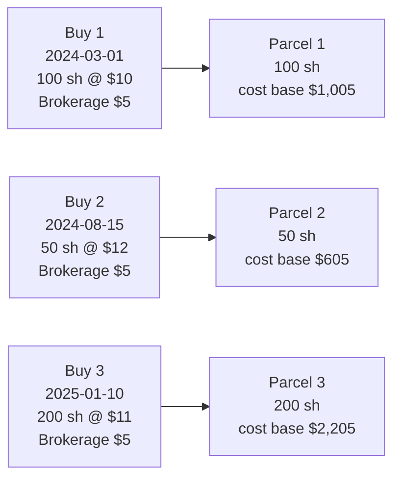
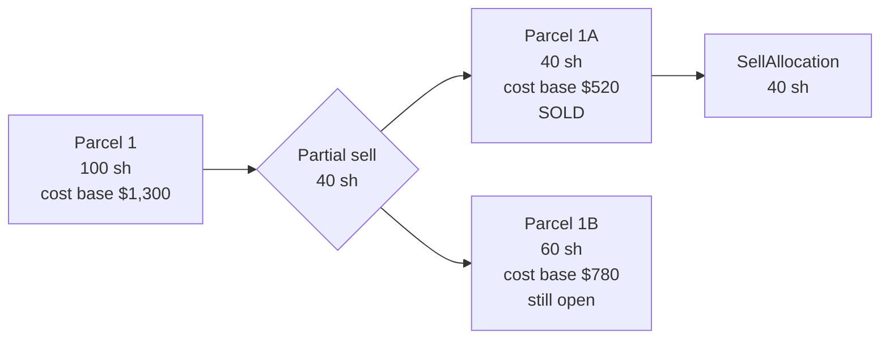
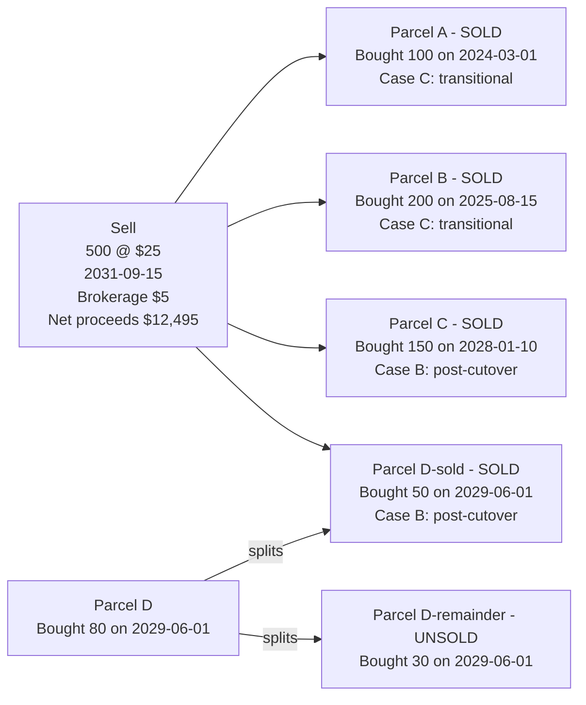
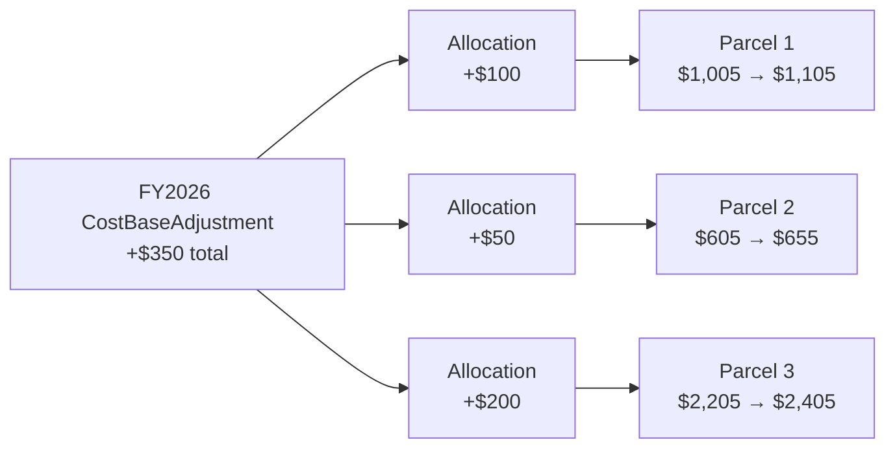
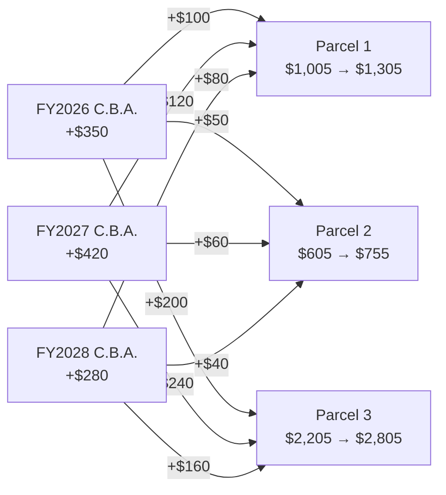
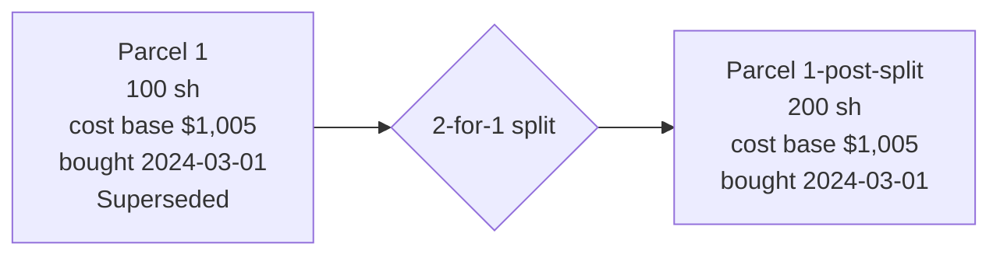
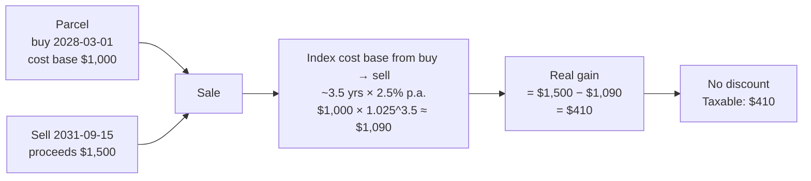
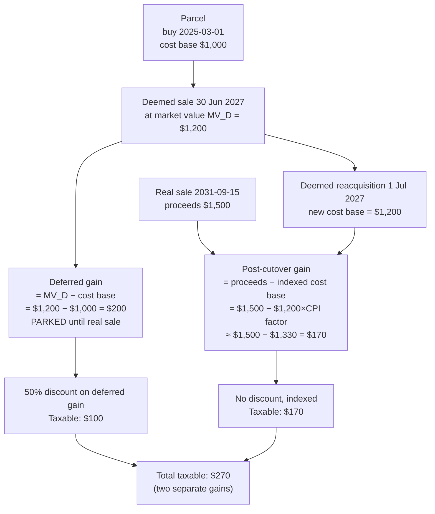
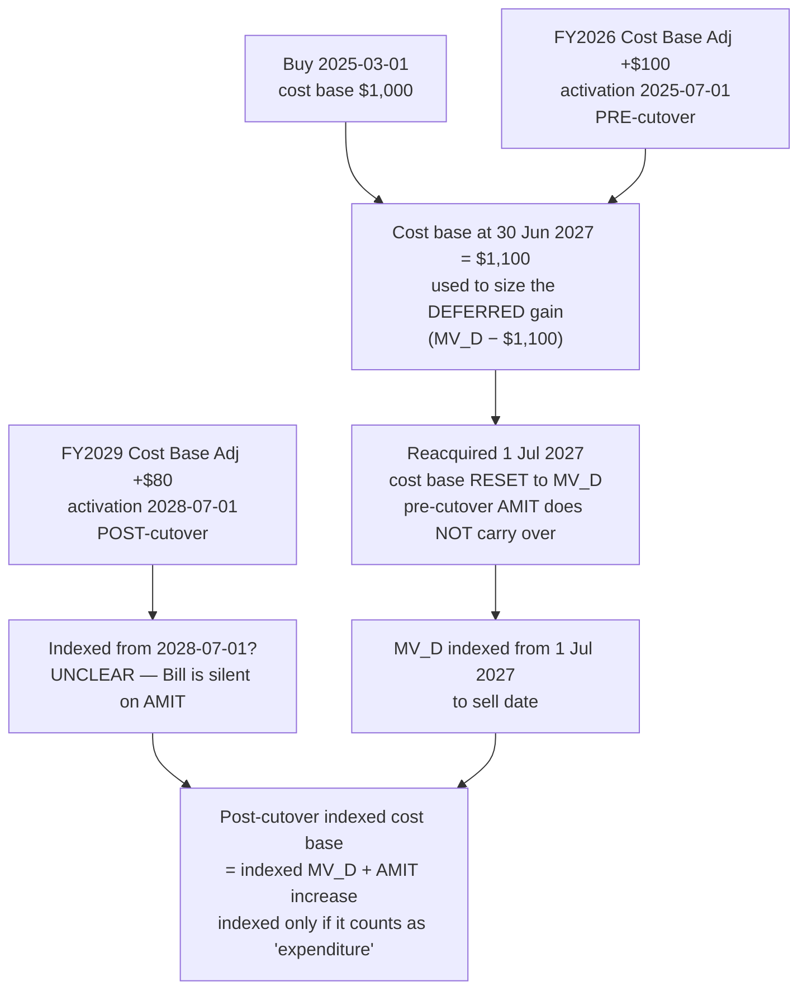
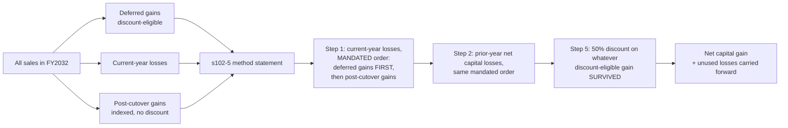

# The 2027 CGT changes are really complex

Here's a write-up about the complexity associated with the proposed CGT changes outlined in the [Treasury Laws Amendment (Tax Reform No. 1) Bill 2026](https://www.aph.gov.au/Parliamentary_Business/Bills_Legislation/Bills_Search_Results/Result?bId=r7493).

---

## Part 1: The current situation

Before getting into what's changing, it's worth setting out how share portfolios should be tracked for CGT today. A lot of the complexity in the proposed reforms comes from how it interacts with the existing record-keeping model rather than the headline change itself.


### Background: Parcel tracking
Every Buy creates an independent **Parcel** with its own cost base and acquisition date. Parcels are the unit of accounting for CGT. Every later transaction (sells, AMIT adjustments, etc.) must tracked against specific parcels.


```mermaid
flowchart LR
    B1[Buy 1<br/>2024-03-01<br/>100 sh @ $10<br/>Brokerage $5] --> P1[Parcel 1<br/>100 sh<br/>cost base $1,005]
    B2[Buy 2<br/>2024-08-15<br/>50 sh @ $12<br/>Brokerage $5] --> P2[Parcel 2<br/>50 sh<br/>cost base $605]
    B3[Buy 3<br/>2025-01-10<br/>200 sh @ $11<br/>Brokerage $5] --> P3[Parcel 3<br/>200 sh<br/>cost base $2,205]
```

If you buy shares every month, ten years of buying creates ~120 separate parcels, each one independently tracked. Independent parcel tracking is necessary because every parcel has its own holding period, its own cost base(s), and under the proposed changes, its own indexation factor.


Note: Technically, every single share in a parcel of shares is a distinct capital gains asset, so sometimes, parcels must be split to smaller pieces.


### Background: Parcel splitting

If a sell only consumes *part* of a parcel, the parcel splits into a "sold" portion and an "unsold" portion.


```mermaid
flowchart LR
    P1[Parcel 1<br/>100 sh<br/>cost base $1,300] --> BIF{Partial sell<br/>40 sh}
    BIF --> P1A[Parcel 1A<br/>40 sh<br/>cost base $520<br/>SOLD]
    BIF --> P1B[Parcel 1B<br/>60 sh<br/>cost base $780<br/>still open]
    P1A --> SA[SellAllocation<br/>40 sh]
```

The remainder takes on a proportional fraction of original parcel's cost base.

 Although the remainder is a new parcel, it inherets the original acquisition date of the original parcel. That date is important under CGT calculation rules.

### Background: One sale, many parcels

A single sale rarely maps one-to-one with a single parcel. If you sell 500 shares from an ETF you've been accumulating monthly, that sale could be allocated across multiple parcels, with the last parcel typically only partially consumed, leaving a small remainder (which then splits as above).


```mermaid
flowchart LR
    S[Sell<br/>500 @ $25<br/>2031-09-15<br/>Brokerage $5<br/>Net proceeds $12,495] --> A[Parcel A - SOLD<br/>Bought 100 on 2024-03-01<br/>Case C: transitional]
    S --> B[Parcel B - SOLD<br/>Bought 200 on 2025-08-15<br/>Case C: transitional]
    S --> C[Parcel C - SOLD<br/>Bought 150 on 2028-01-10<br/>Case B: post-cutover]
    S --> D1[Parcel D-sold - SOLD<br/>Bought 50 on 2029-06-01<br/>Case B: post-cutover]
    D[Parcel D<br/>Bought 80 on 2029-06-01] -->|splits| D1
    D -->|splits| D2[Parcel D-remainder - UNSOLD<br/>Bought 30 on 2029-06-01]
```

The selection of parcels is up to you. Specific parcels, FIFO, LIFO, or aiming to minimise CGT. All are valid, but you need to keep records of your choice.

Sell-side brokerage is an **incidental cost of the CGT event** — in the diagram above the $5 brokerage reduces the $12,500 gross proceeds to $12,495 net. Buy-side brokerage works the same way at the other end (an *incidental cost to acquire*) and is already folded into each parcel's cost base.

Each sale allocation gets its own independent tax treatment: its own acquisition date, its own holding period, and (under the new regime) its own indexation factor and Case A/B/C classification. Combine this with 120 parcels from a decade of monthly DCA, and one decent-sized sale produces a fan-out of independent sub-calculations that all have to be summed at the bottom.

### Background: elements of cost base

A parcel's cost base is not a single number. It is a sum of separate elements. The [Income Tax Assessment Act 1997](https://www.legislation.gov.au/C2004A05138/latest/downloads) (s110-25) defines five.

1. Acquisition cost. What you paid for the shares.
2. Incidental costs. Buy brokerage, and the costs of the CGT event such as sell brokerage.
3. Costs of owning. Interest, fees, and similar, provided that these costs aren't claimed as deductions. Rare for listed shares.
4. Capital costs to preserve value. Spending to protect the asset.
5. Capital costs to defend title. Legal costs to establish ownership.

Each element is recorded with the date it was incurred. Today the date does not matter much. Under the new regime it does. Indexation runs per element, from the quarter each element was incurred. So the elements must be tracked apart, not merged.

There is also a parallel **reduced cost base**, used when working out a loss. It mostly mirrors the cost base. But costs of owning are excluded from it. For listed shares the two numbers are usually equal.

### Background: Cost base adjustments (AMIT)

If you hold Australian ETFs or managed funds, you get annual **AMIT statements** that adjust the cost base of each parcel you held during the year. Upward when the fund attributed more taxable income than it distributed, downward when the reverse.

A single AMIT statement is apportioned across every parcel held during the relevant fiscal year. I split the adjustment according to a weigthing of (quantity of shares in each parcel) x (days of the financial year the parcel was held).


```mermaid
flowchart LR
    CBA[FY2026 CostBaseAdjustment<br/>+$350 total] --> A1[Allocation<br/>+$100]
    CBA --> A2[Allocation<br/>+$50]
    CBA --> A3[Allocation<br/>+$200]
    A1 --> P1[Parcel 1<br/>$1,005 &rarr; $1,105]
    A2 --> P2[Parcel 2<br/>$605 &rarr; $655]
    A3 --> P3[Parcel 3<br/>$2,205 &rarr; $2,405]
```

Each allocation is date-stamped with the start of the fiscal year it relates to. This date is irrelevant today, but is likely to become critical once indexation enters the picture.

Adjustments stack over successive fiscal years. The cost base of a parcel at any point in time is the original buy price plus all adjustments active up to that point:


```mermaid
flowchart LR
    CBA1[FY2026 C.B.A.<br/>+$350] -- +$100 --> P1
    CBA1 -- +$50 --> P2
    CBA1 -- +$200 --> P3

    CBA2[FY2027 C.B.A.<br/>+$420] -- +$120 --> P1
    CBA2 -- +$60 --> P2
    CBA2 -- +$240 --> P3

    CBA3[FY2028 C.B.A.<br/>+$280] -- +$80 --> P1
    CBA3 -- +$40 --> P2
    CBA3 -- +$160 --> P3

    P1[Parcel 1<br/>$1,005 &rarr; $1,305]
    P2[Parcel 2<br/>$605 &rarr; $755]
    P3[Parcel 3<br/>$2,205 &rarr; $2,805]
```

Ten years of monthly buys is 120 parcels; a single AMIT statement then has to be split across all 120, and that happens again every year. A long-running accumulation can easily generate *thousands* of cost base adjustment allocations over its life. The complexity of this adjustment process is what motivated me to migrate my share tracking from Excel to a database tool.

AMIT adjustments don't fall into any of the five cost base buckets.

### Background: Splits and consolidations

Corporate actions occasionally change the *number* of shares you hold without changing what you actually own. A **share split** (e.g. 2-for-1) multiplies your share count; a **consolidation** (reverse split, e.g. 1-for-5) divides it. Neither is a CGT event. There's no disposal, so no gain or loss to report.

What changes is the *shape* of each parcel. Every parcel held at the effective date is rescaled by the same factor: the total cost base is unchanged, just spread across a different number of shares. The acquisition date carries through untouched, which matters for the holding period and (under the new regime) the indexation start date.

For record keeping clarity, I think it is clearer to supersede/ cancel existing parcels, replacing them with new ones.


```mermaid
flowchart LR
    P1[Parcel 1<br/>100 sh<br/>cost base $1,005<br/>bought 2024-03-01<br/>Superseded] --> SPLIT{2-for-1 split}
    SPLIT --> P1N[Parcel 1-post-split<br/>200 sh<br/>cost base $1,005<br/>bought 2024-03-01]
```

Only the quantity moves (and therefore the per-share cost; here $10.05 becomes $5.025). Because cost base and acquisition date are preserved, a split is invisible to the Case A/B/C classification: a parcel that was transitional before the split is still transitional after it.

If you are creating new parcels to replace the ones which are split/consolidated, any cost base adjustment allocations need to be moved to the new parcel.

### Background: Prior year losses

Today, capital losses are pretty easy to deal with. You can mentally net your gains and losses for the year, carry forward any unused losses, and apply 50% to the discount-eligible portion of the result. There's no real ordering question: the discount applies to the *net* gain, so it doesn't matter whether a loss is offset against a discount-eligible gain or a non-discount gain.

The bookkeeping is essentially: total gains − total losses − prior-year carry-forward = net gain. Then halve it (if eligible). Whatever wasn't used becomes next year's carry-forward.

### Background: The official ATO worksheet

[Guide to capital gains tax 2025](https://www.ato.gov.au/forms-and-instructions/guide-to-capital-gains-tax-2025/how-to-get-the-guide-to-capital-gains-tax)

[Capital gain or capital loss worksheet 2025](https://www.ato.gov.au/forms-and-instructions/capital-gain-or-capital-loss-worksheet-2025)


The ATO publishes a **Capital gain or capital loss worksheet** (NAT 4151, current edition June 2025) — one filled in per CGT asset, per disposal. Each worksheet breaks the cost base into six elements (acquisition cost, incidental costs to acquire, incidental costs of the CGT event, costs of owning, capital expenditure to preserve value, capital costs to defend title) and runs three parallel calculations side-by-side: **indexation method** (frozen at 30 September 1999, legacy assets only), **discount method**, and **"other" method** (held <12 months).

The worksheet also runs a parallel **reduced cost base** column for use when calculating a loss. Not every element counts the same way: "costs of owning" (interest, rates, maintenance) sits in the cost base but is excluded from the reduced cost base, and indexation never applies to the reduced cost base column. For listed shares the two numbers are usually identical, but the *two-column structure* is baked into the form.

For a long-running listed-share portfolio, most cells are zero today and the indexation column is dormant. But the *shape* of the worksheet — separate columns for unindexed cost base, indexation factor, and indexed cost base — is exactly what the 2027 reforms re-activate. The structural template hasn't gone anywhere; it's been waiting.

---

## Part 2: The proposed changes

### Headline rules

Effective `D = 1 July 2027` (the date is hard-coded throughout the Bill):

1. **The 50% CGT discount drops to 0% by default** for CGT events on or after `D`, and is replaced with **cost-base indexation** for individuals and trusts (CPI, mirroring the pre-1999 regime). The discount isn't truly *abolished*, though — new section 115‑100 keeps a 50% discount for a handful of categories: pre-cutover gains (see below), **new residential dwellings** (s115‑102), **affordable housing** (s115‑125), and **any other kind of CGT asset the Minister nominates by legislative instrument** (s115‑102(3)). New paragraph 115‑100(f) is the catch-all: *0% if none of the above applies*. For ordinary listed shares, the default is 0% discount + indexation.
2. A **transitional rule** for assets held across `D`, implemented by **deeming every asset you hold on 30 June 2027 to be sold just before `D` and reacquired on `D` at market value** (new Subdivision 112‑E). The gain on that deemed sale is *deferred* until you actually sell, where it keeps the 50% discount; the reacquired asset then runs on the new indexed regime — more on this under Case C.
3. A **30% minimum effective tax rate** on real (post-cutover) capital gains, specified as **Division 119** (Part 2 of the Schedule). It's largely out of scope for a portfolio tracker — it depends on your whole-of-income position — but the Bill tells us exactly *which* gains feed into it (see [The 30% minimum tax](#the-30-minimum-tax)).

**Indexation is not for everyone.** New subsection 110‑36(1A) limits the post-`D` indexation to **individuals and trusts** (broadly, to the extent the ultimate beneficiaries are resident individuals — s114‑25). Companies and complying super funds don't get it. There's a **residency test** (s114‑25: you must be neither a foreign nor a temporary resident across the testing period) and the usual **12‑month rule** (s114‑10) — though the deemed reacquisition on `D` is *disregarded* for the 12‑month test (s114‑10(9)), so your original acquisition date still counts.

Three cases fall out of these rules, and they're a useful mental model even though the Bill's machinery is the deemed-sale one:

| Case | Buy date | Sell date | Treatment |
|---|---|---|---|
| **A** | any | < `D` | Unchanged. Current regime (50% discount / pre-1999 indexation). |
| **B** | &ge; `D` | &ge; `D` | New regime only. Indexed cost base, no discount. |
| **C** | < `D` | &ge; `D` | Transitional: a **deferred gain** (discount eligible) crystallised at `D` **+** a fresh **indexed gain** on the reacquired asset. |

Case C is particularly tricky and it's going to be the dominant case for *years* after the cutover because most of us here are holding assets bought well before 2027.

> **Pre-CGT assets** (acquired before 20 Sept 1985) get caught too: s112‑175 deems them sold and reacquired at market value on `D`, so they *stop being pre-CGT* on 1 July 2027. The pre-cutover growth is disregarded (no CGT on it), except where CGT event K6 bites (s112‑180). After `D` they're ordinary indexed CGT assets with a cost base reset to their 1 July 2027 market value.

### Case B: Pure indexation


```mermaid
flowchart LR
    P[Parcel<br/>buy 2028-03-01<br/>cost base $1,000] --> SA
    S[Sell 2031-09-15<br/>proceeds $1,500] --> SA
    SA[Sale] --> IDX[Index cost base from buy &rarr; sell<br/>~3.5 yrs &times; 2.5% p.a.<br/>$1,000 &times; 1.025^3.5 &asymp; $1,090]
    IDX --> G[Real gain<br/>= $1,500 &minus; $1,090<br/>= $410]
    G --> T[No discount<br/>Taxable: $410]
```

This is the one the Budget paper's worked examples walk through, and it's worth being clear about the rate. The Budget examples all use **a flat 2.5% per annum** ("Inflation is 2.5 per cent each year Zoe holds the assets", same for David, Ben and Kate) — but that's just an illustrative number. The legislation uses **real CPI**: new subsections 960‑275(1B) and (1C) define the post-`D` `indexation factor` by plugging into the *existing* index-number machinery of Subdivision 960‑M (the same machinery that drove the pre-1999 regime, just without the September-1999 freeze). The actual factor formulas are set out there as equations.

So the new regime reuses the pre-1999 mechanic almost exactly:

```
indexation_factor = CPI(quarter of disposal) / CPI(quarter the expenditure was incurred)
```

Two consequences for implementation:

- **Quarterly resolution.** The factor keys off the quarter expenditure was incurred (s960‑275(1B)), so an implementation needs a CPI series stored at quarterly resolution.
- **Per-element, from when incurred.** Each cost-base element is indexed separately from the quarter it was *incurred*, not from the parcel's acquisition date (s114‑1, s114‑10). That means the AMIT activation dates discussed below are load-bearing, not decorative.

(The third element — costs of ownership — is never indexed: s960‑275(4), carried through by s114‑1.)

### Case C: Transitional — deemed sale and reacquisition

This is the case that **breaks the simple "halve the gain" model**. You might expect it to work by storing the asset's value at `D` and, when you eventually sell, splitting that one sale into a pre-segment and a post-segment. The Bill instead uses a **deemed sale and reacquisition** (Subdivision 112‑E, s112‑155 for individuals / s112‑165 for trusts):

- On **30 June 2027** you're deemed to have *sold* the asset at its market value, and on **1 July 2027** to have *reacquired* it for the same amount. The cost base is reset to that market value.
- The gain or loss on that deemed sale — the Bill calls it your **initial notional gain/loss** — is *disregarded and deferred* (s112‑160). You don't report it in 2027; it's parked until the asset is actually sold (the **realisation event**).
- When you finally sell, two separate gains land in the same income year: your **deferred gain** (the parked pre-cutover gain, which keeps its 50% discount via s115‑100(aa)/(ab)) **and** a fresh gain on the reacquired asset (proceeds − indexed market-value cost base, no discount).


```mermaid
flowchart TB
    P[Parcel<br/>buy 2025-03-01<br/>cost base $1,000] --> DS
    DS[Deemed sale 30 Jun 2027<br/>at market value MV_D = $1,200] --> DG[Deferred gain<br/>= MV_D &minus; cost base<br/>= $1,200 &minus; $1,000 = $200<br/>PARKED until real sale]
    DS --> RE[Deemed reacquisition 1 Jul 2027<br/>new cost base = $1,200]
    S[Real sale 2031-09-15<br/>proceeds $1,500] --> POST
    RE --> POST[Post-cutover gain<br/>= proceeds &minus; indexed cost base<br/>= $1,500 &minus; $1,200&times;CPI factor<br/>&asymp; $1,500 &minus; $1,330 = $170]
    DG --> DGD[50% discount on deferred gain<br/>Taxable: $100]
    POST --> POSTD[No discount, indexed<br/>Taxable: $170]
    DGD --> TOT["Total taxable: $270<br/>(two separate gains)"]
    POSTD --> TOT
```

The arithmetic comes out the same as a simple pre/post segment split ($200 deferred + $170 post = $270 taxable) — but the *mechanism* matters a lot for implementation, because it maps cleanly onto something share-dinkum already does: **superseding a parcel**. The deemed sale/reacquisition is essentially a corporate-action-style supersession on 30 June 2027 — cancel the old parcel, create a new one at market value, and hang a `deferred gain/loss` attribute off it. (See the *Splits and consolidations* section above for the existing supersession pattern.)

To run it you still need **what the asset was worth on 1 July 2027** (`MV_D`). The Bill gives two routes for the deemed capital proceeds (s112‑155(3)):

- **Market value (the default)**: the asset's market value just before 1 July 2027. For listed shares, trivially the close price that day.
- **An apportioning method** *determined by the Minister by legislative instrument* (s112‑185). Note this is **not** the simple straight-line formula the Budget illustration implied — the actual method is delegated and doesn't exist yet. The Bill only specifies what such a method must take into account (the reacquisition, post-`D` expenditure including indexation, etc.).

The choice is **per realisation event**, and s103‑25 lets you defer it right up until you lodge the return for the year you actually sell (s112‑155(4)) — so you don't have to commit in 2027. **The choice isn't neutral**: market value front-loads the (discount-eligible) deferred gain when the asset grew quickly; the apportioning method may do better for slow growers. Once that ministerial method is published it'll be worth evaluating both per realisation event and picking the better one.

This process applies to every parcel held across `D`, and the deferred gain has to be carried on each one until it's eventually sold (recall: one sale, many parcels).

### AMIT adjustments crossing the cutover

Today, AMIT adjustments are just a number that gets added to the parcel's cost base. The activation date is recorded but unused. The deemed-sale mechanism keeps the *pre*-cutover side clean — the cutover wipes the slate — but it leaves a real open question on the *post*-cutover side, because the Bill never mentions AMIT.

The dividing line is the 30 June 2027 deemed sale:


```mermaid
flowchart TB
    B[Buy 2025-03-01<br/>cost base $1,000] --> COSTD
    CBA1[FY2026 Cost Base Adj +$100<br/>activation 2025-07-01<br/>PRE-cutover] --> COSTD
    COSTD["Cost base at 30 Jun 2027 = $1,100<br/>used to size the DEFERRED gain<br/>(MV_D &minus; $1,100)"]
    COSTD --> RESET[Reacquired 1 Jul 2027<br/>cost base RESET to MV_D<br/>pre-cutover AMIT does NOT carry over]

    CBA2[FY2029 Cost Base Adj +$80<br/>activation 2028-07-01<br/>POST-cutover] --> IDX_CBA2[Indexed from 2028-07-01?<br/>UNCLEAR &mdash; Bill is silent on AMIT]
    RESET --> IDX_MVD[MV_D indexed from 1 Jul 2027<br/>to sell date]

    IDX_CBA2 --> SUM[Post-cutover indexed cost base<br/>= indexed MV_D + AMIT increase<br/>indexed only if it counts as 'expenditure']
    IDX_MVD --> SUM
```

The two halves behave very differently:

- **Pre-cutover AMIT adjustments** fold into the cost base *as it stands on 30 June 2027*, which is what the deemed sale uses to size your deferred gain (a bigger pre-cutover cost base = a smaller deferred gain). They do **not** carry into the post-`D` side, because the reacquisition resets the first element of the cost base to market value (s112‑155(2)(b)). That's a genuine simplification — you don't drag a decade of pre-cutover adjustments across the line.
- **Post-cutover AMIT adjustments** are the open question. The Bill **doesn't mention AMIT at all** — no reference to Division 276, "cost base net amount", or the AMIT cost-base adjustment rules. Indexation under s960‑275(1B) attaches to "**expenditure**… **in an element of the cost base**… **incurred** on or after 1 July 2027". An AMIT *increase* isn't obviously that: it's a statutory uplift to the cost base as a whole (via the AMIT provisions), not expenditure you incur in one of the five cost-base elements (s110‑25). So on a literal reading the indexation machinery may not reach it without more. There's a clear *policy* case for indexing it — an AMIT increase reflects income already attributed to (and taxed in) your hands, so measuring a real gain would want it inflation-adjusted from when it accrued — but the Bill doesn't draw that link, and there's no pre-1999 precedent because AMIT didn't exist then. **Treat this as unresolved.**

**Where AMIT sits in the calculation order.** It's worth being precise, because it's easy to picture AMIT as another "step" alongside the discount — it isn't. AMIT adjustments operate at the **cost-base level**, upstream of the entire s102‑5 method statement:

```
COST-BASE LEVEL  (Div 110 / 114 / Subdiv 960-M)
  1. Cost base = first element + each later item of expenditure
                 + AMIT increases  − AMIT decreases     (each dated)
  2. Index the indexable elements — each from its OWN incurral quarter
        |
GAIN          capital gain = proceeds − indexed cost base
        |
METHOD STATEMENT  (s102-5)
  steps 1-2   apply losses (mandated category order)
  steps 3-4   quarantined amounts
  step 5      50% discount          <- discount happens HERE
  step 6      small business concessions
```

So AMIT adjustments are applied **before** the discount — the discount (step 5) only ever touches the net gain that the AMIT-adjusted cost base produced, never an AMIT amount directly.

But "before indexation" needs care, because it's tempting to conclude that anything in the cost base ahead of the indexation step automatically gets indexed. It doesn't. **Indexation isn't a multiplier on the cost-base total — it's a per-item operation, gated on a test:**

```
indexed cost base = Σ ( each item of expenditure × factor for THAT item's quarter )
```

The factor only attaches to amounts that clear the s960‑275(1B) hook — *"expenditure in an element of the cost base, incurred on or after 1 July 2027"* — and each qualifying item indexes from **its own** quarter, not the parcel's. An item that doesn't clear the gate enters the sum at face value (factor 1). The proof that "in the cost base ≠ indexed" is already in the law: the **third element** (costs of ownership) sits in the cost base but is explicitly denied indexation (s960‑275(4)). So the unsettled question is genuinely whether a post-cutover AMIT **increase** clears that gate: if it's "expenditure in an element" it indexes from its activation quarter; if it's a statutory uplift to the cost base *as a whole* (which is what it looks like), it lands in the un-indexed bucket alongside the third element. (AMIT **decreases** raise the mirror question — reduce the indexed or the unindexed amount? — also unaddressed.)

If you're accumulating ETFs across the cutover, the post-`D` side still explodes quickly. With monthly buys, 10 years of holding is ~120 parcels; each parcel gets a post-cutover AMIT allocation every fiscal year it's still held; and each of those allocations has its own (putative) indexation start quarter. The number of `(parcel × adjustment)` combinations you need to track, each with its own indexation factor, gets large fast.

### Losses get more complicated too

The simple "net gains, net losses, halve the result" approach doesn't work under the new regime, and the Bill's loss-ordering rules land mostly **not** in the taxpayer's favour.

- **Indexation cannot turn a small loss into a bigger loss**. Losses are computed against the **reduced cost base** (the worksheet's parallel column), to which indexation is never applied. So losses come out *nominal* even when gains in the same year are computed on an *indexed* cost base. Under the new regime the reduced cost base column stops being a curiosity that most listed-share investors can ignore.
- **Losses must be applied before the discount/indexation**, in a statutory order. The Bill rewrites the s102‑5(1) method statement into **seven steps** with **four new gain categories**: *deferred non‑residential*, *deferred residential*, *non‑residential*, and *residential* capital gains. ("Deferred" = the pre-cutover gains parked by the deemed sale; the non-deferred ones are post-cutover gains. For shares, ignore the residential/non-residential split — shares are always non‑residential.)
- **Carried-forward losses decay in real value over time.** A $1,000 loss from 2028 is still $1,000 nominal in 2035, but the gains it's offsetting in 2035 have been indexed up in the meantime. The longer you carry a loss, the less of an inflated future gain it covers — a "use it sooner" pressure that doesn't exist under the current discount regime.

You might expect the taxpayer to be able to choose which gains a loss offsets, and therefore to **preserve discount gains by burning losses against non-discount gains first**. The Bill does the opposite. Step 1 of the new method statement applies losses **in a mandated category order**: `(a)` deferred non‑residential → `(b)` deferred residential → `(c)` non‑residential → `(d)` residential. Deferred (i.e. pre-cutover, 50%-discount) gains get hit **first**, before the post-cutover indexed gains — and the 50% discount is only applied later, at step 5. You only get free choice *within* a category (Note 3 to step 1), not across them.


```mermaid
flowchart LR
    Sells[All sales in FY2032] --> G1[Deferred gains<br/>discount-eligible]
    Sells --> G2[Current-year losses]
    Sells --> G3[Post-cutover gains<br/>indexed, no discount]
    G1 --> AGG
    G2 --> AGG
    G3 --> AGG
    AGG[s102-5 method statement]
    AGG --> S1["Step 1: current-year losses,<br/>MANDATED order:<br/>deferred gains FIRST,<br/>then post-cutover gains"]
    S1 --> S2[Step 2: prior-year net capital losses,<br/>same mandated order]
    S2 --> S5[Step 5: 50% discount on whatever<br/>discount-eligible gain SURVIVED]
    S5 --> NET[Net capital gain<br/>+ unused losses carried forward]
```

For a pure share portfolio this is a meaningful constraint. The per-dollar value of a loss varies by what it lands on:

| $1 of nominal loss applied against | Reduces taxable income by |
|---|---|
| Case A gain (50% discount-eligible, pre-`D` sale) | $0.50 |
| Case C deferred gain (pre-cutover, 50% discount) | $0.50 |
| Case C post-cutover gain (indexed, no discount) | $1.00 |
| Case B indexed gain (no discount) | $1.00 |

…but the Bill **forces** losses onto the $0.50 deferred gains *before* the $1.00 indexed gains, which is exactly the order a taxpayer would *not* choose. So there's no clever sort-and-apply algorithm to write for the cross-category step; that optimisation is legislated away. (The freedom that remains — ordering multiple gains *inside* one category — is real but low-stakes for most share investors.) And a loss can't be cherry-picked against the "post-segment" of one sale, because there are no per-sale segments — the deferred gain and the post-cutover gain are separate gains pooled at the Division 102 level, and the mandated order governs the whole pool.

The upshot: less to optimise, but you still have to *reproduce the mandated ordering exactly* to get the right number, and the four-category bookkeeping is new.

### Tax return categories split pre-D / post-D

Today, capital gains are reported on the tax return in three method buckets: **indexation method** (legacy pre-1999 assets), **discount method** (50% discount, held >12 months), and **other method** (held <12 months, no concession).

Rather than bolt a pre-D / post-D axis onto those three buckets, the Bill defines the split *in the law itself* as the **four new gain categories** that drive the s102‑5 method statement. Those categories are the structure:

| Statutory category (s102‑6) | What it is, for shares | Discount? | 30% min tax? |
|---|---|---|---|
| **Deferred non‑residential** | Pre-cutover gain parked by the deemed sale (Case C) | 50% (s115‑100(aa)/(ab)) | No |
| **Non‑residential** | Post-cutover gain on a reacquired or newly-bought asset (Case B/C) | 0% + indexation | **Yes** (Div 119) |
| **Deferred residential** / **Residential** | The property-side mirrors of the above | (property rules) | residential only |

Genuinely pre-`D` sales (Case A — sold before 1 July 2027) still report under the old discount / other / indexation method buckets; the new categories only exist for the income year that includes 1 July 2027 and later.

The reason the split lives in the law: the **30% minimum tax (Division 119) only bites the *non-deferred* categories** — `minimum tax capital gain` is defined (s119‑5) as residential + non-residential gains remaining after step 6, explicitly **excluding** deferred gains and excluding new-residential-dwelling (s115‑102) and affordable-housing (s115‑125) gains. So the deferred/non-deferred boundary *is* the pre-D/post-D boundary the minimum tax needs.

The thing that's structurally new is still true, just re-expressed: **a single Case C disposal produces gains in *two* categories** — a deferred gain (discount, no min tax) and a non-residential gain (indexed, min tax). Today every sale lands in exactly one method bucket; across the cutover, a transitional holding straddles two.

For share-dinkum this changes the shape of `CGTBreakdown`. It's not enough to return a single taxable scalar, or even a `(pre, post)` pair — the breakdown needs to tag each gain with its s102‑6 *category*, so a return-shaped report can roll many sales up into the right rows and so the minimum-tax-relevant slice can be isolated.

### The 30% minimum tax

Computing the 30% minimum tax itself stays out of scope for a portfolio tracker — it depends on your whole-of-income position, not just your share gains — but the Bill spells out the mechanism in **Division 119**, so it's worth knowing what it does:

- It applies to **individuals who are Australian residents** (s119‑10) and only to **CGT events on or after 1 July 2027** (transitional s119‑1).
- The `minimum tax capital gain` (s119‑5) is your post-cutover residential + non-residential gains **after** all the s102‑5 concessions (i.e. after indexation) — the *real* gain — excluding new-residential-dwelling and affordable-housing gains, and excluding deferred (pre-cutover) gains.
- The method statement (s119‑10(2)) takes 30% of that gain, subtracts the ordinary tax that gain actually bore at your marginal rate, and the shortfall (the `minimum tax gap amount`) is charged as **extra income tax**. In effect it tops high earners up to a 30% floor on their indexed gains, clawing back part of the indexation benefit.
- There's a carve-out (s119‑15) for recipients of certain means-tested or social-security payments.

So a tracker still won't *compute* the top-up, but it now has to surface the one input the calculation needs from the portfolio side: the total of post-cutover, non-deferred, non-concession gains. That's exactly the `non‑residential` category from the table above — another reason the breakdown has to carry the s102‑6 tag rather than a single number.

---

## Part 3: Implementing this in share-dinkum

The detailed implementation plan for share-dinkum is broken out into a separate document: [`capital_gains_changes_plan.md`](./capital_gains_changes_plan.md).

---

## TL;DR / discussion

- The Budget examples make the changes look like one-line indexation. For anything held across the cutover, they're not — the Bill **deems every asset sold and reacquired at market value on 1 July 2027** (Subdivision 112‑E), parking the pre-cutover gain as a *deferred* gain and running the reacquired asset on indexation. Same arithmetic as a "two segment" split, very different machinery.
- The Bill settles several mechanics: indexation uses **real CPI** (the existing s960‑275 index-number machinery), not a flat rate; pre-cutover AMIT adjustments fold into the deemed-sale cost base and don't carry over; and **loss ordering is mandated** (s102‑5) so that pre-cutover discount gains absorb losses *first* — the opposite of what a taxpayer would choose, and not something you can optimise around.
- One thing the Bill **doesn't** resolve: whether **post-cutover AMIT cost-base increases get indexed**. The Bill never mentions AMIT, and indexation only attaches to "expenditure in an element of the cost base" — which an AMIT statutory uplift arguably isn't. Genuinely open.
- The 50% discount isn't abolished outright — it survives at **0% by default** but stays 50% for deferred gains, new residential dwellings, affordable housing, and any asset kind the Minister later nominates. The **30% minimum tax** is concrete (Division 119) and bites only the post-cutover, non-deferred, non-concession gains.
- Still **not** settled — all delegated to ministerial legislative instruments that don't exist yet: the **apportioning method** alternative to market value (s112‑185), the **asset kinds** that keep a 50% discount (s115‑102(3)), and the **new-residential-dwelling** definition (s26‑160). And of course the Bill itself isn't law yet.
- The deemed sale/reacquisition is actually *good news* for share-dinkum's data model: it's a corporate-action-style **parcel supersession** on 30 June 2027 (cancel the old parcel, create a new one at market value, attach a deferred gain), which is a pattern the tool already has.
- The implementation strategy I'm landing on: ship the new data model and calculation path dormant behind a flag, let users opt in per-account to preview, flip the default once the Bill passes and the instruments land.

Anything I've misread in the Bill would be very welcome — corrections especially.

---

## Placeholder content

The five cost base elements and how each is treated.

| # | Element | Indexed (new regime)? | In reduced cost base? | Notes |
|---|---|---|---|---|
| 1 | Acquisition cost | Yes | Yes | Indexed from its own quarter, only if incurred on or after 1 July 2027. |
| 2 | Incidental costs | Yes | Yes | Buy brokerage and CGT event costs such as sell brokerage. |
| 3 | Costs of owning | No | No | Never indexed (s960-275(4)). Excluded from the reduced cost base. |
| 4 | Capital costs to preserve value | Yes | Yes | Indexed from its own quarter. |
| 5 | Capital costs to defend title | Yes | Yes | Indexed from its own quarter. |
| - | AMIT adjustment | Unclear | Yes (net amount) | Sits outside the five elements. Indexation status is unresolved (Bill is silent). |

Notes.

- Indexation applies per element, from the quarter the cost was incurred. Costs before 1 July 2027 are not indexed under the new regime; they ride on the deemed sale instead.
- Indexation never applies to the reduced cost base. Losses are nominal.
- AMIT is not a cost base element. It adjusts the cost base as a whole. See the AMIT crossing the cutover section.
