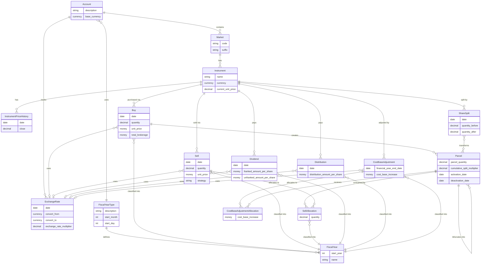

# Detailed data model

This page shows the full entity relationship diagram for Share Dinkum, including key fields on each entity. For a high-level overview see the [README](../README.md#simplified-overview).

*Not shown: AppUser, LogEntry, CurrentExchangeRate, DataExport.*
