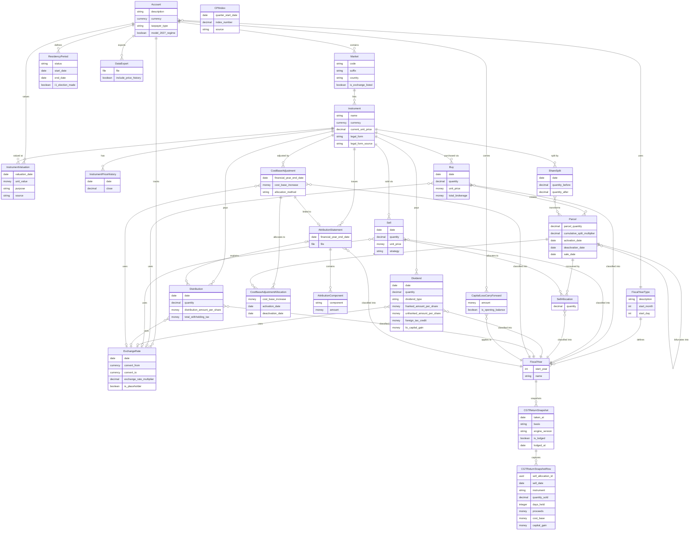

# Detailed data model

This page shows the full entity relationship diagram for Share Dinkum, including key fields on each entity. For a high-level overview see the [README](../README.md#simplified-overview).

```mermaid
erDiagram
    Account ||--o{ Market : "contains"
    Account ||--o{ ExchangeRate : "tracks"
    Account ||--o{ ResidencyPeriod : "defines"
    Account ||--o{ InstrumentValuation : "values"
    Account ||--o{ DataExport : "exports"
    Account ||--o{ CapitalLossCarryForward : "carries"
    Account }o--|| FiscalYearType : "uses"
    FiscalYearType ||--o{ FiscalYear : "defines"

    Market ||--o{ Instrument : "lists"
    Instrument ||--o{ InstrumentPriceHistory : "has"
    Instrument ||--o{ InstrumentValuation : "valued at"
    Instrument ||--o{ AttributionStatement : "issues"

    Instrument ||--o{ Buy : "purchased via"
    Instrument ||--o{ Sell : "sold via"
    Instrument ||--o{ Dividend : "pays"
    Instrument ||--o{ Distribution : "pays"
    Instrument ||--o{ CostBaseAdjustment : "adjusted by"
    Instrument ||--o{ ShareSplit : "split by"

    Buy ||--o{ Parcel : "creates"
    Parcel ||--o{ Parcel : "bifurcates into"
    Parcel ||--o{ SellAllocation : "consumed by"
    Sell ||--o{ SellAllocation : "allocates to"

    CostBaseAdjustment ||--o{ CostBaseAdjustmentAllocation : "allocates to"
    CostBaseAdjustment ||--o| AttributionStatement : "linked to"
    Parcel ||--o{ CostBaseAdjustmentAllocation : "receives"
    ShareSplit }o--o{ Parcel : "transforms"

    Buy }o--o| ExchangeRate : "uses"
    Sell }o--o| ExchangeRate : "uses"
    Dividend }o--o| ExchangeRate : "uses"
    Distribution }o--o| ExchangeRate : "uses"
    CostBaseAdjustment }o--o| ExchangeRate : "uses"

    Buy }o--|| FiscalYear : "classified into"
    Sell }o--|| FiscalYear : "classified into"
    SellAllocation }o--|| FiscalYear : "classified into"
    Dividend }o--|| FiscalYear : "classified into"
    Distribution }o--|| FiscalYear : "classified into"
    CostBaseAdjustment }o--|| FiscalYear : "classified into"
    CapitalLossCarryForward }o--|| FiscalYear : "applies to"

    AttributionStatement ||--o{ AttributionComponent : "contains"
    AttributionStatement |o--o{ Distribution : "explains"
    AttributionStatement }o--|| FiscalYear : "classified into"
    FiscalYear ||--o{ CGTReturnSnapshot : "snapshots"
    CGTReturnSnapshot ||--o{ CGTReturnSnapshotRow : "captures"

    Account {
        string description
        currency currency
        string taxpayer_type
        boolean model_2027_regime
    }
    Market {
        string code
        string suffix
        string country
        boolean is_exchange_listed
    }
    Instrument {
        string name
        currency currency
        decimal current_unit_price
        string legal_form
        string legal_form_source
    }
    Buy {
        date date
        decimal quantity
        money unit_price
        money total_brokerage
    }
    Sell {
        date date
        decimal quantity
        money unit_price
        string strategy
    }
    Parcel {
        decimal parcel_quantity
        decimal cumulative_split_multiplier
        date activation_date
        date deactivation_date
        date sale_date
    }
    SellAllocation {
        decimal quantity
    }
    Dividend {
        date date
        decimal quantity
        string dividend_type
        money franked_amount_per_share
        money unfranked_amount_per_share
        money foreign_tax_credit
        money lic_capital_gain
    }
    Distribution {
        date date
        decimal quantity
        money distribution_amount_per_share
        money total_withholding_tax
    }
    CostBaseAdjustment {
        date financial_year_end_date
        money cost_base_increase
        string allocation_method
    }
    CostBaseAdjustmentAllocation {
        money cost_base_increase
        date activation_date
        date deactivation_date
    }
    ShareSplit {
        date date
        decimal quantity_before
        decimal quantity_after
    }
    ExchangeRate {
        date date
        currency convert_from
        currency convert_to
        decimal exchange_rate_multiplier
        boolean is_placeholder
    }
    FiscalYear {
        int start_year
        string name
    }
    FiscalYearType {
        string description
        int start_month
        int start_day
    }
    InstrumentPriceHistory {
        date date
        decimal close
    }
    ResidencyPeriod {
        string status
        date start_date
        date end_date
        boolean i1_election_made
    }
    AttributionStatement {
        date financial_year_end_date
        file file
    }
    AttributionComponent {
        string component
        money amount
    }
    InstrumentValuation {
        date valuation_date
        money unit_value
        string purpose
        string source
    }
    CapitalLossCarryForward {
        money amount
        boolean is_opening_balance
    }
    DataExport {
        file file
        boolean include_price_history
    }
    CGTReturnSnapshot {
        date taken_at
        string basis
        string engine_version
        boolean is_lodged
        date lodged_at
    }
    CGTReturnSnapshotRow {
        uuid sell_allocation_id
        date sell_date
        string instrument
        decimal quantity_sold
        integer days_held
        money proceeds
        money cost_base
        money capital_gain
    }
    CPIIndex {
        date quarter_start_date
        decimal index_number
        string source
    }
```

Every table except AppUser, FiscalYearType, FiscalYear and CPIIndex belongs to an Account; only the
main account links are drawn. CPIIndex is shared across accounts.

*Not shown: AppUser, LogEntry, CurrentExchangeRate.*
